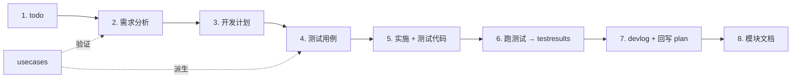
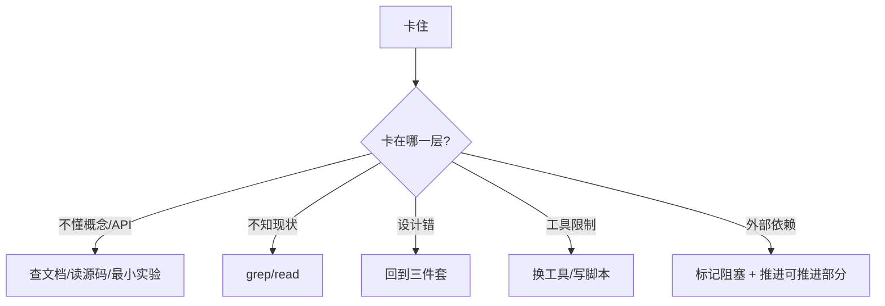

# AI Coding Agent 通用开发规范

AI coding agent 协作开发的总纲，自包含、可拷贝到任何项目。

> **优先级**：项目级 instructions（CLAUDE.md / 直接指令） > 本文档 > 默认行为。技术栈相关约定写到项目自己的 CLAUDE.md。

## 1. 核心原则

| 原则 | 含义 |
|---|---|
| **方向明确就一鼓作气** | 不做 MVP。需求清晰就把验收、错误路径、测试一次性铺到生产级。 |
| **以用户与场景为锚** | 写 plan 前先答：目标用户是谁？什么场景触发？解决什么问题？答不出 → 先写用例。 |
| **不估工时，但记实耗时** | plan 禁写"预计 N 天"。devlog 必记实际耗时，作为下次的语料。 |
| **高标准 + 不钻牛角尖** | 主路径必须达标；边缘高成本项记到 todo / lessonlearned，不阻塞主线。 |
| **第一性原理 + 客观为准** | 用户实际需要 + 数据本身 > 直觉与习惯。**记忆与代码现状冲突时永远以代码为准**。 |
| **不畏难，不绕路** | 难点是任务的一部分。拆解到根因（知识/设计/工具/外部依赖），不用 workaround 隐藏问题。 |
| **先定位再动手** | 改代码前先读代码：grep/read 建现状地图，靠证据不靠假设。落点不清就先探索，别先写。 |
| **跑过才算做完** | 声称"完成/修好"前必须实际运行并观察；贴真实输出，测试失败如实说，无证据不下结论。 |

## 2. 需求分析三件套（plan 必填）

| 维度 | 必答 |
|---|---|
| 目标用户 | 角色 + 痛点（一句话） |
| 使用场景 | 任务流哪一步触发？前置状态？高频/低频？替代什么旧流程？ |
| 产品定位关联 | 关联到哪份 usecase 或战略主线；找不到关联就**先问，不要写** |

"不做什么"列表与"做什么"同等重要。

## 3. 反 MVP 的具体表现

- 不留 "TODO: 错误情况后面加" → 错误路径与 happy path 同时实现
- 不留 "TODO: 等业务验证再加测试" → 测试与代码同 commit
- 不留 "暂时硬编码" → 直接配置化（除非配置化本身是大工程，独立 phase）

**何时真分阶段**（不是 MVP）：上下游依赖未就绪 / 单 phase 独立有用户价值 / 需 spike 验证假设（spike 完成后**重写**正式实现，不要把 spike 当产品代码）。

## 4. SDD 八步流程



| 步骤 | 文档 |
|---|---|
| 1. todo | `todo.md` — 粗略想法 |
| 2-3. plan | `docs/plans/YYYY-MM-DD-<topic>.md` — 三件套 + 范围 + 不做什么 + 数据模型 + API + Phase + 验收标准 + 关联用例/TC |
| 4. testcases | `docs/testcases/<topic>.md` — 从 plan 验收标准展开的可执行测试清单 |
| 5. 实施 | 源码 + 测试代码同 PR；偏离 plan 就**回写 plan** |
| 6. testresults | `docs/testresults/YYYY-MM-DD-<topic>-<run>.md` — 重要节点（phase 完成 / 上线前 / bug 修复验证）一份 |
| 7. devlog | `docs/devlogs/YYYY-MM-DD-<topic>.md` — 设计/偏离/坑/**实耗时** |
| 8. 模块文档 | `docs/modules/<module>.md` — 长期真源 |

**横切文档**：

- `docs/usecases/<scenario>.md` — 端到端用户旅程；plan 必须引用；新需求先看有没有覆盖
- `docs/architecture/<topic>.md` 或 `docs/adr/<n>-<title>.md` — 跨 issue 的关键技术决策
- `docs/lessonlearned/<slug>.md` — 通用可迁移的经验（问题→原则→做法，≤15 行）

## 5. testcases / testresults

**testcases**（与 plan 同名）：

```markdown
## TC-001 · 用户能 <做什么>
- 所属用例 / 优先级 P0-P2 / 验证方式 unit|integration|e2e|manual
- 前置：...
- 步骤：...
- 预期：...
- 测试代码位置（实施后填）：path/to/test.ts
```

规则：plan 验收标准每条 ≥1 TC；TC 编号一旦发布**不复用**。

**testresults**：自动化层 pass/fail/coverage 表 + 手动层按 TC 勾选 + 可选性能基线 + 偏差跟进。文件名 run 段建议 `phase-X-completion` / `pre-ship` / `regression-after-fix-XXX`。

**testresults vs devlog 边界**：质量度量 → testresults；为什么这么做 → devlog。

## 6. 实施期判断准则

**高标准底线**：

| 维度 | 底线 |
|---|---|
| 命名 | 表意准确，与现有约定一致 |
| 错误处理 | 系统边界（用户输入 / 外部 API / DB / LLM）显式处理；内部默认信任 |
| 测试 | 验收标准每条 ≥1 TC；纯逻辑必有 unit test |
| 可观测 | 关键路径有 log/metric，失败可定位 |
| 国际化 | 用户可见文案进 i18n，按项目支持语言全量铺 |
| 文档 | plan/devlog/模块文档与代码同 PR |
| 验证 | 改动必经实际运行/测试观察；"修好了"要附证据（命令输出 / 通过的测试），不靠推断 |

**不钻牛角尖的边界**：

- 主路径 → 必须解决
- 边缘路径，成本 ≤1h → 顺手解决
- 边缘路径，成本极高 → 记 todo / lessonlearned
- 历史债噪音 → 批量另起 PR

**第一性原理 4 步决策**：用户视角 → 数据视角（代码/git log/metrics）→ 成本视角 → 可逆性（可逆快做，不可逆慢做并记 ADR）。

**改动卫生**：diff 聚焦单一目标，不夹带无关重构/格式化噪声（要做就另起 PR）；新代码风格随周围代码，不引入个人偏好。

**外部参考与许可底线**：参考其它实现的**算法**可以，**拷贝其代码**要先确认许可兼容。从不兼容许可（如 GPL → Apache）的项目移植时，只按算法独立重写、禁止逐行搬运，并在源码注明出处（参考了哪个类/文件）。具体项目的参考来源与边界写到 CLAUDE.md。

## 7. 遇困姿态



**红旗（在逃避困难）**：

- `try { } catch { /* ignore */ }` 吞错 → 读懂根因，要么修要么显式上抛
- `--no-verify` / `--force` 绕校验 → 修好让它通过
- 删测试让 CI 绿 → 修代码或修断言（明确哪种）
- "不影响功能先不管"但没记 todo → 至少一行到 todo
- "你帮我看下日志" → 自己跑工具/读 log/复现
- 声称"已修复/已完成"但没真正跑过 → 先跑给自己看，把证据贴出来
- 一个 PR 塞无关重构/格式化噪声 → 拆出去，保持 diff 聚焦

半小时无进展 → 停下重审"卡在哪一层"，不要反复试同一方向。

## 8. 时间记录

**禁估工时**。devlog 必有：

```markdown
## 实际耗时
- 起止：YYYY-MM-DD HH:MM ~ YYYY-MM-DD HH:MM（自然 Nh，专注 ~Mh）
- 分布：调研 ~Xh / plan+testcases ~Xh / 实施 ~Xh / 调试+文档 ~Xh
- 偏离最大的环节：<描述>（耗 Xh，已沉淀到 lessonlearned/<slug>.md）
```

## 9. 自己决定 vs 先问

| 自己决定 | 先问 |
|---|---|
| 命名 / 内部实现 / 测试组织 | 用户可见行为 / 文案语气 |
| 改动 ≤1 issue / 可逆 | 删除/重命名公共 API、不可逆 DB 改动 |
| | 引入新依赖 / 外部服务 |
| | 跨模块大重构 |
| | plan 偏离 >30% |
| | 用户描述与代码现状矛盾 |

**带证据问**：不是"这怎么办"，而是"X 文件 Y 行 A 与你说的 B 冲突，方案 P1/P2 代价 Z，我倾向 P1，对吗？"

## 10. PR 自检清单

- [ ] plan 三件套齐全
- [ ] 不是 MVP — 错误路径、国际化、测试、可观测都铺到位
- [ ] testcases ↔ plan 验收标准一一对应；测试代码 pass
- [ ] 改动前已读过相关代码（不靠假设）；改完已实际运行验证，证据落到 testresults/devlog
- [ ] 外部参考均为独立实现并标注出处，无许可不兼容的代码拷贝
- [ ] devlog 记录**实耗时**
- [ ] 偏离 plan 已**回写 plan**（不是只在 devlog 提）
- [ ] 通用经验已沉淀到 lessonlearned
- [ ] 无吞错 / 无 `--no-verify` / 无"暂时硬编码"
- [ ] 自检："目标用户现在用，会顺吗？"

## 11. 文档写作规范

- 中文叙述、英文代码/字段（项目主语言为英文则反之）
- 简明扼要，避免冗长段落；用表格、Mermaid、列表
- 不内联大段代码，用 `path/to/file.ts:42` 引用
- TC 编号 `TC-NNN`，发布后不复用
- testresults 文件名 `YYYY-MM-DD-<topic>-<run>.md`

## 12. 落地新项目

1. 拷贝本文件到根目录
2. 项目 CLAUDE.md 顶部加：`> 通用规范见 ./AI_AGENT_DEV_SPEC.md`
3. 建目录骨架：`docs/{plans,usecases,testcases,testresults,devlogs,modules,architecture,lessonlearned}/`
4. 项目特有约定（技术栈、命名、目录、lint/format）写到 CLAUDE.md，本文件保持技术栈无关
