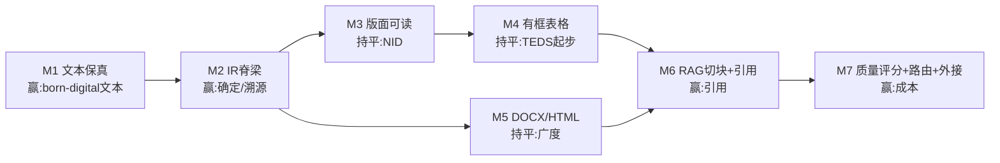

# 执行计划 · 击败 Docling 的里程碑分解（M1–M7）

> 本文是 [roadmap.md](../roadmap.md) 的**执行层细化**：把 roadmap 的 P0–P4 阶段按竞争杠杆拆成带验收的可执行里程碑。**战略不在这里写**——
>
> - **对标 Docling 的赢/持平/不打定位** → [roadmap §2](../roadmap.md)
> - **记分牌（NID/TEDS/MHS + 体积/冷启/确定性/引用率）** → [roadmap §6](../roadmap.md)
> - **大模块与分阶段（P0–P4）** → [roadmap §4–5](../roadmap.md)
> - **解析器特性战术清单** → [iteration-guide §5](../iteration-guide.md)
>
> 本文只回答："具体先做哪个里程碑、依赖谁、做完算什么。" **代码现状永远是真源**：与代码不符时以代码为准并回写本文。

---

## 1. 次序原则

**先把快路径做对（文本）→ 早定 agent 契约（IR/溯源/评分）→ 再攻结构与广度 → 最后叠路由与外接模型。** 与 roadmap §3"先定契约，再造机器"一致；关键再排序：据 roadmap §3 把 **IR 脊梁（M2）从 P3 提前到紧跟 P1**——便宜且解锁后续所有溯源/切块/路由。每个里程碑**独立有用户价值**，括号内为 roadmap §4 大模块号。

---

## 2. 里程碑

### M1 · 数字文本保真（完成 P1 文本部分）— *模块 2* ✅ 完成（2026-06-09）
**赢下"born-digital 文本"的地基。**

- [x] **标准 14 字体 AFM 度量**：14 套 AFM 宽度表（`stdmetrics.rs`），无 `Widths` 时按字形名查宽度。
- [x] **简单字体 Encoding/Differences + AGL**：无 ToUnicode 时 code→字形名→Unicode（`encoding.rs`/`encoding_tables.rs`）。
- [x] **字距操作符 `Tc`/`Tw`/`Tz`**：位移公式 `tx=(Σw·Tfs+Tc·n+Tw·spaces)·Th`（`interpreter.rs`）。
- **验收 ✅**：14 单测（+8）、clippy 零 warning、三件套+2408 零回归（lorem 387/bialetti 3829 不变）、修复 `rectification`→原 `rectication` 连字丢失。诊断纠正了根因（是解码非宽度）。devlog：[2026-06-09-m1-text-fidelity.md](../devlogs/2026-06-09-m1-text-fidelity.md)。
- **遗留**（非本次回归）：标题词粘连→M3；CM 数学字体内建编码→按需。

### M2 · IR 脊梁：版本化 + provenance + 评分骨架 — *模块 1、7* ✅ 完成（2026-06-09）
**"确定/可溯源"两项胜负手的载体，便宜、高杠杆，必须早定**（roadmap §3）。

- [x] **IR 版本化**：`SCHEMA_VERSION="0.2.0"` + serde `default` 前后兼容（`ir.rs`）。
- [x] **provenance**：文档级 `Provenance{schema,parser,version}` + 每 chunk `confidence`；元素级溯源用已有 `bbox+page`。
- [x] **质量评分骨架**：`core::quality`（coverage/garbled/flags），只产分不行动；CLI `--quality`。
- **验收 ✅**：provenance 入 JSON；每 chunk 带 bbox+page+confidence（引用可定位率 100%）；**确定性 100/100** 逐字节一致；scan→coverage 0+`scanned_no_text`，1901→coverage 1.0/garbled 0。零回归，clippy 零 warning。devlog：[2026-06-09-m2-ir-spine.md](../devlogs/2026-06-09-m2-ir-spine.md)。
- **遗留**：reading-order 异常分留空（待 M3）；元素级 source 覆盖→M7。

### M3 · 版面可读：段落聚合 + 页眉页脚 — *模块 3* ✅ 完成（2026-06-09）
把"逐行文本流"升成"可读段落"，直接抬 **NID**。

- [x] **段落聚合**：新 `core::layout`，行→段/标题；合并严格门控（间距+字号+**触达列右缘 fill_x**+非数字行）避免糊掉表格。
- [x] **页眉/页脚识别**：跨页 margin 内归一化文本重复（≥半数页）→ 剔除；数字折叠匹配页码。
- **验收 ✅**：1901 摘要重排为段、bialetti 表格逐行不糊；header/footer 单测覆盖、真实样例零假阳性；确定性 30/30；四样例零回归；clippy 零 warning；单测 core 12 + pdf 14。devlog：[2026-06-09-m3-readable-layout.md](../devlogs/2026-06-09-m3-readable-layout.md)。
- **遗留**：多栏左列暂不重排（fill_x 是整页右缘，待 M4 列检测）；旋转戳干扰；标题词内粘连。

### M4 · 语义结构起步：有框表格 — *模块 4* ✅ MVP 完成（2026-06-09）
**TEDS 战的入口。** 有规则线的表格确定性求解，对照 `veraPDF-wcag-algs` 独立实现。

- [x] 内容流抽矢量线段（`m`/`l`/`re`/`c`/`h` + 绘制 flush、裁剪 `n` 丢弃，CTM 变换）。
- [x] 线段聚类→网格→单元格，文本归位（单元格复用 `reconstruct_lines` 重建词/多行）。
- [x] IR 加 `Element::Table`；Markdown 管道表格 / text 制表行；表内 chunk 去重。
- **验收 ✅**：bialetti 财报检出 2 表（25×5 / 8×5），单元格干净；**图形页（lorem/1901/2408）零误判**（外框+≥2×2 硬门控）；零回归；确定性 30/30；clippy 零 warning；core 15 + pdf 14 单测。devlog：[2026-06-09-m4-bordered-tables.md](../devlogs/2026-06-09-m4-bordered-tables.md)。
- **遗留（显式未覆盖）**：单元格粗于视觉行（源按段画线）、合并单元格 span、多表/页分离、无框表格（→M7 外接）。

### M5 · 多格式广度：DOCX → HTML — *模块 5*（可与 M3/M4 并行）
Docling 的广度是其首选理由。**OOXML/HTML 有显式结构、无需版面推断、ROI 最高**，且 `core` 阅读顺序/输出自动复用（iteration-guide §3C）。

- [ ] `docparse-docx`：`impl DocumentParser`，解析 OOXML 段落/标题/表格/列表，坐标按 PDF 约定用合成布局折算。
- [ ] `docparse-html`：DOM → 同一 IR。
- [ ] CLI 注册表各加一行（[main.rs](../../crates/docparse-cli/src/main.rs)）。
- **验收**：DOCX/HTML 端到端出 JSON/MD/Text；标题层级直接拿到（OOXML 有显式 style），抬 **MHS**。

### M6 · RAG 输出与引用定位 — *模块 6*（**引用是杀手锏**）
Docling 有 RAG 生态但引用非全链路。把 **chunk ↔ 页码/bbox 双向定位**做成一等公民——agent/RAG 最想要、Docling 给不全的东西。

- [ ] **结构化切块**：按标题/段落/表格边界切，chunk 携带 source bbox + 页码 + provenance（依赖 M2）。
- [ ] **双向引用**：给定 chunk 回指原文坐标；给定坐标找 chunk。
- [ ] **接口面**：先库 API + CLI，再评估 MCP server（agent 直连）。
- **验收**：差异化记分牌"引用可定位率 100%"；最小 RAG demo：检索结果可高亮回原 PDF 坐标。

### M7 · 质量评分驱动的路由 + 外接 AI — *模块 7、8*（**成本胜负手**）
**"多数页不碰模型、只难例升级"的成本论点落地**，roadmap"晚建机器"的部分。把 M2 评分接上路由。

- [ ] 质量评分判定难例（低覆盖/高乱码/表格未闭合）。
- [ ] **可插拔外接边界**：版本化 capability（格式/元素/语言/设备），按页触发外接 OCR/LLM/VLM，结果归一回同一 IR。
- [ ] 主流程**无外接也能独立产出**（身份约束：AI 可插拔）。
- **验收**：扫描件页触发外接、数字页不触发；记录命中率与成本，证明"多数页走快路径"。

> M8+（远期，roadmap P4）：稳定小模型 ONNX 内嵌；安全预检/隐藏文本过滤（模块 9）；服务化运行时（模块 10）。本文不展开。

---

## 3. 次序与依赖一览

| 里程碑 | 依赖 | 主要赢的指标 | roadmap 模块 |
|---|---|---|---|
| M1 文本保真 | — | born-digital 文本正确率 | 2 |
| M2 IR 脊梁 | — | 确定性、引用可定位率 | 1,7 |
| M3 版面可读 | M1 | NID | 3 |
| M4 有框表格 | M2,M3 | TEDS（起步） | 4 |
| M5 DOCX/HTML | M2 | MHS、广度 | 5 |
| M6 RAG 切块+引用 | M4,M5 | 引用、RAG 可用性 | 6 |
| M7 评分+路由+外接 | M2,M6 | 成本、难例覆盖 | 7,8 |

M1/M2 无依赖可并行起步；M5 可与 M3/M4 并行（不同 crate，互不阻塞）。**边界与风险**（不打扫描 OCR、不复刻 wcag-algs 全量、不拷 GPL、不过早造编排机器）见 [roadmap §7](../roadmap.md)。

---

## 4. 立即可执行的下一步

**M1 标准 14 字体 AFM 度量**已在进行中，是当前头号任务（roadmap §8 / iteration-guide §5）。完成 M1 后即可并行起 **M2 IR 脊梁**（便宜、解锁后续所有溯源/切块/路由）。

每进入一个里程碑前补 `docs/plans/<milestone>.md`，完成后回填 `docs/testresults/` 与 `docs/devlogs/`（SDD 流程，AI_AGENT_DEV_SPEC §4）。
