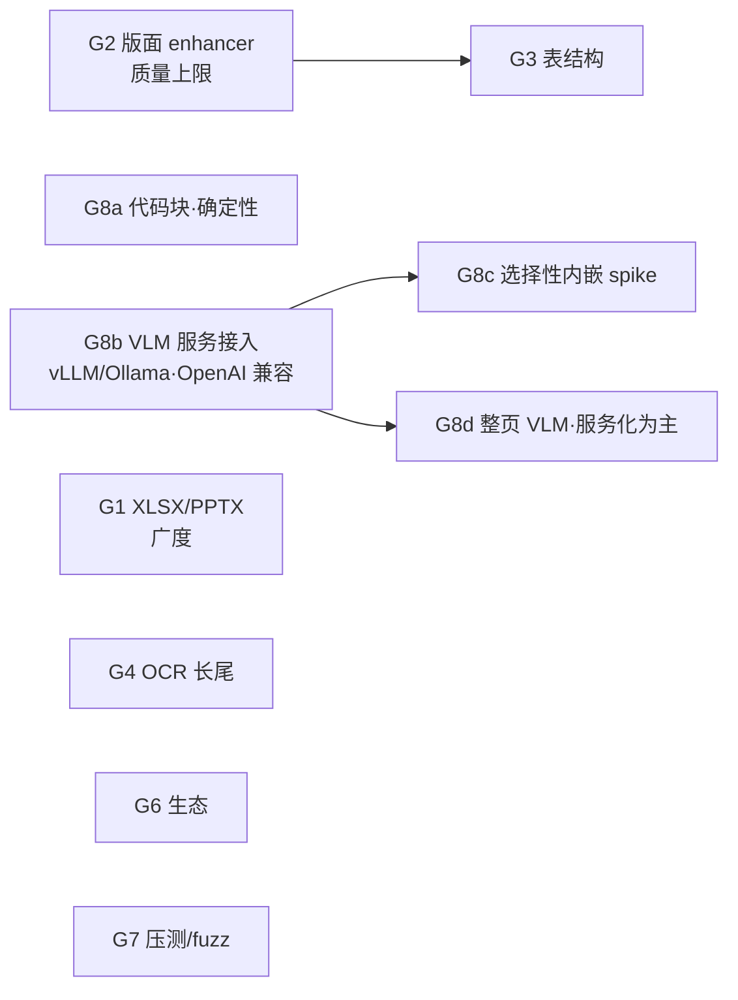

# 迭代计划 · Phase 4(G1–G8):补齐 Docling 明显占优的轴

> 依据:[refer/docling-objective-comparison.md](../refer/docling-objective-comparison.md) 的诚实清单——逐条映射成里程碑。承接 [next-iteration.md](next-iteration.md)(N1–N6 已收官)。
>
> **边界(2026-06-10 定位修订)**:纯 Rust/确定性核心独立/模型可插拔不动;"不光栅化"改述为"**主流程不渲染像素;难页 AI 增强可按需用纯 Rust 工具渲染该页(默认关闭)**"——以"速度快、质量好"的产品定位为准。补差距的手段分三层——**确定性可自研的直接做**(格式广度/区域 OCR/Form 流/代码块检测),**小模型沿 N3 已验证的 P4 模式内嵌**(tract + 外部 ONNX,先 spike 门控),**重模型/VLM 经 G8 语义增强面接入**(HTTP 外接先行,纯 Rust 运行时内嵌后探)。显式不追仅剩:GPU、为格式数铺长尾货。

## 0. 差距 → 里程碑映射

| Docling 优势(对比文档 §1) | 应对 | 里程碑 |
|---|---|---|
| 格式广度 15+ vs 3 | 确定性自研平齐:XLSX/PPTX/MD/CSV(G1a)+ 邮件/字幕/图片/AsciiDoc/LaTeX/XML 族(G1b) | **G1** |
| 难版面质量上限(神经版面) | ONNX 版面模型内嵌,难页路由(P4 模式) | **G2** |
| 表格结构精度(TableFormer) | ONNX 表结构模型内嵌(SLANet 系) | **G3** |
| OCR 广度(区域级/方向/多语种) | 区域级 OCR + cls + 多语种字典 + Form 流 | **G4** |
| RTL | BiDi 阅读顺序(评估需求后做) | **G5** |
| 生态(LangChain/LlamaIndex/社区) | Python 薄客户端 + 两个 loader + crates.io | **G6** |
| 鲁棒成熟度(海量语料锤炼) | 大语料压测 + fuzzing | **G7** |
| 内容增强(公式 LaTeX/代码/图片/图表/整页 VLM) | 三层:确定性 → HTTP 外接 → 纯 Rust VLM spike | **G8** |
| **对 ODL 的结构层差距**(表覆盖/列表/标题层级/Tagged PDF) | 确定性自研(wcag-algs 方法论 + 结构树解析) | **G9** |

## 1. 里程碑

### G1 · 格式广度:与 Docling 平齐(含长尾)— *模块 5* · 确定性自研
广度是 Docling 被首选的第一理由。**目标改为平齐**(用户决策 2026-06-10,撤销"不铺长尾"非目标):格式数 3 → 12+。全部走 `DocumentParser` trait + `synth` 合成坐标,每格式一个薄后端,注册表一行。

**G1a 主流办公(先做)**:

- [x] **G1a 全部完成 ✅**(2026-06-10,[devlog](../devlogs/2026-06-10-g1a-format-breadth.md)):docparse-xlsx(calamine)/ docparse-pptx(zip+quick-xml,每 slide 一页)/ docparse-md(pulldown-cmark)/ docparse-csv(零依赖手写)——格式数 3→7,97 单测,零回归。

**G1b 长尾(对齐 Docling 后端清单)**:

- [x] **邮件 EML ✅**(2026-06-11,依赖已批,[devlog](../devlogs/2026-06-11-g1b-eml-img-encoding.md)):docparse-eml(mail-parser 0.9)——Subject→标题、From/To/Date 元数据行、首个文本体→段落(HTML-only 邮件自动转文本、RFC2047 主题解码、quoted-printable/base64 由库承担)、附件列举 `[attachment] 名 (字节)`;docling 真实样例 2 份全过。嵌套 rfc822 不下钻(边界)。
- [x] **字幕 SRT/WebVTT ✅**(2026-06-11,[devlog](../devlogs/2026-06-11-srt-vtt-subtitles.md)):docparse-srt(零依赖手写),每 cue 一段 `[hh:mm:ss] 文本`(时间戳=可引用性,保留);VTT 头部/NOTE/STYLE 跳过、`<v 说话人>`→前缀、行内标签剥除。顺带修了 synth 段距 bug(所有 synth 后端段落被 1.8em 合并门错并——影响 docx/html/md 文本输出)。
- [x] **图片即文档(PNG/JPEG)✅**(2026-06-11,依赖已批,同 devlog):docparse-img(zune-png/zune-jpeg)——单页全幅 ImageChunk(1px=1pt,JPEG 原字节零转码、PNG 解到 Gray8/Rgb8)→ `scanned_no_text` 路由 → `--ocr` 全管线复用;**往返验收**:chinese_scan PDF 经 `--image-dir` 抽出 PNG、独立 OCR 出中文全文正确。TIFF/16-bit PNG 不支持(干净报错)。
- [~] **AsciiDoc / LaTeX 源码**:**LaTeX 子集 ✅**(2026-06-11,[devlog](../devlogs/2026-06-11-latex-backend.md)):docparse-tex(零依赖行导向)——title/author/maketitle、section 三级、abstract、itemize/enumerate(LI 标签)、tabular→真 Table、figure/table 取 caption、数学环境原样保留、注释/转义/跨行声明配平;7 份真实 arXiv 源码全过(含 OTSL/Attention 论文),边界文档化(\input 不追、自定义宏不展开)。**AsciiDoc ✅**(2026-06-11,docparse-adoc 零依赖行导向:文档标题/分节/列表/`----` 代码块/`|===` 表/注释与属性行,格式数 11→12)。
- [ ] **XML 族(JATS 学术/METS-ALTO 档案)**:按真实需求逐个立项(quick-xml 复用);METS-ALTO 自带坐标,可出**真实 bbox**(非合成)。
- **验收**:每格式经同一 IR 出 chunks(带合成或真实 bbox);`supports()` 按扩展名注册;每格式至少一个样例端到端 + 单测;现有格式零回归。格式数 3→12+。

### G2 · 版面 enhancer:ONNX 版面模型内嵌 — *模块 8 / P4 模式* · 🎯 质量上限的正解
聚合记分牌剩余 gap(CJK 信息图 0.12–0.22、复杂首页)全在这——确定性已证不可强攻,Docling 靠 DocLayNet 系模型赢的就是这层。

- [x] **Spike 门控 ✅**(2026-06-10,[devlog](../devlogs/2026-06-10-g2-layout-spike.md)):DocLayout-YOLO(75MB,DocStructBench 含中文)在 `tract` 直接跑通,输出已解码框无需 NMS;CJK 难页正确识别双栏/标题/页眉脚;2.37s/页(仅难页触发)。table/formula 区域同模型可得(G3/G8c 共用)。
- [ ] **光栅来源**:born-digital 页需真实渲染(草图已否决)——选型分析见 [refer/rasterization-options-analysis.md](../refer/rasterization-options-analysis.md)✅ **已决**(2026-06-10):`docparse-raster` crate 包 hayro(纯 Rust,99ms/页),enhancer 难页按需渲染、默认关闭;外部工具兜底链暂不做。
- [ ] **触发**:N5c 画像已就绪——`scanned`/`mixed`/版面复杂信号页才路由(对版面模型,"难页"判据可用确定性输出的异常分:块重叠率/读序回跳),clean 页不碰模型。
- [ ] **归一**:模型出 region(标题/正文/图/表/页眉脚)+ bbox → 重排该页读序、修正标题/表区域;经 `Enhancer` 边界,source 标 `layout:<model>`,确定性结果仍独立成立。
- **验收 → 两轮更正后的真实状态(2026-06-10,[devlog](../devlogs/2026-06-10-g2-layout-enhancer.md) + [重大更正](../devlogs/2026-06-10-g2-correction.md))**:初版"负结果"系两个自家 bug(透明背景致黑渲染、分组替换静默失败)所致,修正后 enhancement 真实点火:**设计感版面大赢**(amt +0.180、normal_4pages +0.128),**clean 学术双栏倒退**(2203 −0.289)——版面模型与确定性几何各有禁区。`--layout` 保持手动 opt-in(记分牌默认不开,零回归);**剩余项=自动路由判据**(读序歧义分/区域分布,行填充率已试败),做成后按页自动取两者之优。

### G3 · 表结构 enhancer:ONNX 表结构模型内嵌 — *模块 8 / P4 模式* · 🔄 复活(2026-06-11)
初版死因:SLANet 死于 ONNX `Loop`(tract 未实现)、TATR 死于导出(见 g3-spike devlog)。**复活依据:[OpenOCR UniRec-0.1B spike 双门全过](../refer/openocr-0.1b-evaluation.md)**(用户提议,2026-06-11)——官方 ONNX 现成(KV-cache 接口)、tract parse/typecheck/optimize 全过、贪心解码与 ORT 逐 token 相同、合并格样本输出完美 HTML(rowspan/colspan)、tract 0.23 实测 169 tok/s ≈2.5s/表(≤5s 门过)。

**G3-R 实施计划**(2026-06-11 立项):

- [x] **R1 · tract 0.21→0.23 升级 ✅**(2026-06-11,f23a4bc):API 迁移(Runnable 别名 Arc 化、`to_plain_array_view(_mut)`);回归门全过(chinese_scan 逐字不变、YOLO 点火、三件套、双记分牌逐字不变)。
- [x] **R2 · UniRec 推理管线 ✅**(2026-06-11,ocr/unirec.rs):按计划实现;实测 pg9 表 3.4s 出完美 HTML(含 span),纯 Rust 全程(双线性缩放足够,无需 bicubic)。
- [x] **R3 · 表任务接线 ✅**(2026-06-11,ocr/table_model.rs):按计划实现,含 rowspan 悬挂网格的正确展开(pending 机制);6 个新单测(含 pg9 真实形状)。
- [x] **验收**:pg9 端到端 10×8 语义正确(rowspan/colspan 准确展开)✅;默认路径零变化(记分牌逐字不变)✅;单测齐 ✅。⚠️ **诚实记录**:flag-on 的一致度 TEDS 反而降(pg9 0.804→0.39、2206 0.421→0.115)——ODL 与 Docling 真值都用**压扁口径**(子行并、跨格合写),模型的忠实结构与之约定冲突,"一致度≠准确度"再添一例(LaTeX 源 \multirow 证实模型才是对的)。定位同 --layout:产品质量增强、手动 opt-in、不进记分牌。真正出口是 rowspan/colspan 语义入 IR(远期)。
- 后续:公式→LaTeX ✅(2026-06-11,`--formula-model`,见 G8c)、**高质量 OCR 档定案**(2026-06-11:即 `--transcribe-model`——中英扫描件标点/结构优于 PP-OCR,代价是行级 bbox 降为区域级;要行级定位用 `--ocr`,两档并存各取所需)、**rowspan/colspan 语义入 IR ✅**(2026-06-11,[devlog](../devlogs/2026-06-11-spans-and-embedded-images.md):`Cell.row_span/col_span/merged`,IR 0.7.0——锚格带跨度、覆盖位标 merged,网格平铺口径不破,eval/默认输出零变化;模型路径填真实 span,确定性路径恒 1×1)、高质量 OCR 档(待设计)。
- [ ] **G3b(确定性兜底)**:保留原描述,优先级降(模型路径已通)。**行内公式**同此:无区域信号(版面模型只出 display 公式区),需行内检测器另立项——显式缓办,理由记录。

### G4 · OCR 长尾 — *模块 8 续*
- [x] **区域级 OCR ✅**(2026-06-10):`MixedTextAndScan` flag 路由混合页,OCR 结果与数字文本空间去重(数字层赢);合成混合页端到端验收。
- [ ] **方向分类 cls**:换源获取(ModelScope/PaddleOCR 官方转换),接入旋转校正;拿不到则文档化跳过。
- [~] **多语种**:模型加载已泛化(文件名自动发现+双前缀消毒,[v5 调研](../refer/paddleocr-v5-evaluation.md)),任意 PP-OCR 语言包目录 `--ocr-models` 即用(v5 server 实测通过);余:v5 mobile 自转、`--ocr-lang` 快捷方式。
- [x] **Form XObject 流解释 ✅**(2026-06-10,[devlog](../devlogs/2026-06-10-g4-form-streams-region-ocr.md)):`exec_content` 递归执行(深度上限 4),form 自带资源各自解析;`right_to_left_02` 0→0.972、表格检出大增 TEDS +30%/+43%;form 文本标 source 防标题误判。
- **验收**:混合页(文本+图章/扫描片段)端到端;Form 内文本/扫描图可达;现有样例零回归。

### G5 · RTL 阅读顺序 — *模块 3* · 按需
3 份 RTL 测试 0 分在案。BiDi 重排(**征询 `unicode-bidi`**)+ XY-cut 镜像。**先评估真实需求再做**——若目标语料无 RTL,显式记弃权而非默认排期。

### G6 · 生态接入 — *模块 10 外延* · 低代码高杠杆
- [x] **Python 薄客户端 ✅**(2026-06-11,[devlog](../devlogs/2026-06-11-g6-python-client.md)):`clients/python/`(docparse-client)——零依赖,子进程包 CLI + urllib 包 REST(手写 multipart),两传输同形输出;stdlib-only 测试 5/5(含活 `docparse serve` 对比 e2e)。
- [x] **LangChain DocumentLoader + LlamaIndex Reader ✅**(同上):惰性导入宿主,每 chunk 一个 Document,metadata 带 `page`/`bbox`/`heading_path`/`kind`;LangChain 经真 langchain-core venv 实测(PDF→6 Documents 带 bbox)——**五行代码验收过**;LlamaIndex 适配器同构,实测候真实使用。
- [ ] **PyPI/crates.io 发布**:需账号/署名决策(用户);MCP server 进 MCP registry 同。
- **验收**:LangChain 五行代码加载 PDF 带引用 metadata ✅;PyPI/crates.io 可安装(候发布)。

### G7 · 鲁棒长尾:语料压测 + fuzzing — *横切*
"海量语料锤炼"没有捷径,但可以系统性逼近:

- [x] **本地语料无 panic 压测 ✅**(2026-06-11,[testresults](../testresults/2026-06-11-g7-stress.md)):`scripts/stress.py`(可重跑)——647 份清洁语料(8 格式,含 veraPDF 参考库 26 份边缘 PDF)+ 1200 个确定性变异样本(截断/字节翻转,SHA-256 播种可复现)= **1847 输入 0 panic 0 超时**;唯一干净 error 是 Shift-JIS CSV——**已修**(2026-06-11,`core::textio` chardetng+encoding_rs 探测解码,csv/srt/tex 接入)。吞吐参考:12MB/32 页杂志 0.10s,647 份 2.9s。
- [~] **cargo-fuzz 烟雾通过**(2026-06-11,依赖已批):nightly+cargo-fuzz 0.13.2 就位,四目标(pdf_parse 全管线/eml/img/text_formats)合计 **~1020 万次执行(ASan),零崩溃**;pdf_parse 覆盖 9167 边、382 exec/s(真实 PDF 种子)。余:24h 长跑(候排期);arXiv 千份级原版口径(需网络/存储决策)。
- [x] 撞到的崩溃/挂起各修各的,沉淀进 `limits` 守卫(本轮零新增——没撞到)。
- **验收**:本地口径 0 panic 0 挂起 ✅;arXiv 千份/fuzz 24h 为加强项,候依赖与资源决策。

### G8 · 语义增强面:公式 / 代码 / 图片 / 图表 / 整页 VLM — *模块 8 扩展*
五项全要(用户决策 2026-06-10,推翻初版"不做"),但按"确定性 → 外接 → 内嵌"三层走,不一步跳到重模型:

- [x] **G8a 代码块检测 ✅**(2026-06-10,[devlog](../devlogs/2026-06-10-g8a-code-blocks.md)):等宽字体名(G2 铺路的 PS 真名)→ 行成组(豁免散文门)→ `Block.code` + 几何缩进重建 → Markdown fenced + chunk kind `code`。code_and_formula 端到端正确,记分牌零回归。
- [~] **G8b VLM enhancer:OpenAI 兼容服务接入** · 🚧 首增量完成(2026-06-10,[devlog](../devlogs/2026-06-10-g8b-vlm-client.md)):`docparse-vlm` crate(协议 mock 单测锁定)+ **图片描述任务**端到端(渲染裁剪→降采样→注入带 source 的位置文本);服务降级不破解析。**第二任务 `--vlm-tables` ✅**(2026-06-11,[devlog](../devlogs/2026-06-11-vlm-tables.md)):`refine_tables` 对已检出表渲染区域→VLM 出 TSV→合格(≥2×2、非散文)才替换网格,`Table.source: "vlm:<model>"` 溯源(IR 新字段),失败保底确定性网格;本地 mock 服务全链路 e2e 过。余项:真实服务实测回填(候 Ollama)、图表→表格、整页转写、页型判官(公式已由 G8c `--formula-model` 内嵌收口;**MCP/REST 透传 ✅** 2026-06-11,[devlog](../devlogs/2026-06-11-serving-enhancements.md):EnhanceState/Opts 两面共用,tool 参数/查询参数透传全部增强开关,UniRec 服务级懒加载一次,活进程 e2e 双过)。原设计如下:
  - **协议**:`/v1/chat/completions` + 图像输入(base64 data URL)——一个协议通吃 vLLM(Qwen2.5-VL/MiniCPM-V 等)、Ollama(qwen2.5-vl/llava 等)、LM Studio 与 OpenAI 系云端;docling-serve 作可选第二后端类型。
  - **配置**:`--vlm-url --vlm-model [--vlm-api-key]`(env 等价物),MCP/REST 透传开关;按任务的 prompt 模板内置(公式→LaTeX / 图片分类+描述 / 图表→表格 / 整页转写),结果归一回 IR 带 `source: "vlm:<model>"` + 低 confidence。
  - **图像来源(身份不破的部分)**:born-digital 的图片**多数本来就是嵌入光栅**——把现有 ImageXObject 解码门改为"VLM 任务开启时按需解码区域图",照片/图表/示意图直接喂 VLM,无需渲染;扫描页用已有位图裁剪。矢量内容(公式/矢量图)仍卡在 G8c 的合成栅格决策点。
  - **成本边界**:任务级 opt-in(默认全关)、按元素触发、并发与超时上限;数字纯文本页零外呼。
  - **依赖征询:HTTP 客户端(`ureq` 倾向,同步轻量)+ base64**。
  - **验收**:Ollama 本地(如 qwen2.5-vl)与 vLLM 各跑通一例图片描述+图表→表格;断网/服务缺失优雅降级(确定性结果不受影响)。
- [~] **G8c 选择性 ONNX 内嵌(spike 门控,P4 模式)**:
  - [x] **公式→LaTeX ✅**(2026-06-11,[devlog](../devlogs/2026-06-11-formula-model.md)):`--formula-model`——DocLayout-YOLO 检 `isolate_formula` 区(class 8)→ UniRec 出 LaTeX → 替换区域内字形汤(`source: "formula:unirec-0.1b"`、tag Formula)。验收样例:基线 "2a + 8 = 12"(上标漂移)→ `\[a^{2}+8=12\]` 正确;LaTeX 防劣化门(须含数学记号、拒表格/散文);默认路径零变化。PP-FormulaNet 不再需要;
  - 图片分类:小 CNN 分类器(图表/照片/示意图)× tract spike;
  - ⚠️ **身份约束决策点**:这些模型吃**区域图**。扫描页区域可从位图裁剪(不破身份);**born-digital 的公式/图是矢量,喂模型必须合成栅格**——是否为"enhancer-only 合成栅格"开例外(主流程仍不渲染),**需用户拍板**;不开例外则 born-digital 区域走 G8b HTTP。
  - [~] **G8d 整页转写**:**内嵌增量 ✅**(2026-06-11,[devlog](../devlogs/2026-06-11-transcribe-model.md)):`--transcribe-model`——YOLO 分区+XY-cut 区序+逐区 UniRec,替换文本层(区域级定位,opt-in)。**域边界实测**:中英域内质量优于 PP-OCR(标点更准);**韩文(评测集的 CJK 缺口恰全是韩文)域外**——幻觉复读循环被新增的**退化守卫**(`looks_degenerate`,周期重复检测,表/公式路径同享)全量拦截,旗标域外安全无害化(NID 逐字不变)。⚠️ 结论:评测集的 CJK 缺口需要韩文能力——仍属 VLM 服务域(Qwen2.5-VL 级,候 Ollama)或换多语种小模型;UniRec 路线对此明确不适用,记录在案。
- **验收**:G8a 代码块在 `code_and_formula` 样例正确标注;G8b 对 Ollama 与 vLLM 各端到端一例(图片描述/图表→表格),数字纯文本页零外呼;G8c 以 spike 结论定去留;G8d 以服务化为主、内嵌 spike 远期。

### G9 · 对齐 ODL 结构层:Tagged PDF / 列表 / 标题层级 / 表覆盖 — *模块 2、4* · 确定性自研
2026-06-10 与 ODL 的逐项差距盘点(Form 流解释后)落项:四块全部确定性可达,无模型依赖。

- [x] **G9a · Tagged PDF 结构读取 ✅(角色);读序实测否决**(2026-06-10,[devlog](../devlogs/2026-06-10-g9a-tagged-pdf.md)):marked-content 跟踪 + 结构树解析 + `TextChunk.tag`(IR 0.6.0)+ H1–H6 强制标题(合成验收过)。**结构树遍历序在野外不可信**(amt 创作序≠视觉序,实测 -0.15)——读序撤回,角色保留。rtl_03 的 0 分定位为字体/编码问题(非标签)。评测集无 H 标签文档,记分牌零变化;价值在真实无障碍文档。
- [x] **G9b · 列表建模 ✅**(2026-06-10,[devlog](../devlogs/2026-06-10-g9b-lists.md)):标记检测(符号/序数,年份排除)+ LI/LBody/Lbl 标签双信号 → chunk kind `list_item` + Markdown 列表;标记行永不并入前块。multi_page 编号列表 10/10;零回归。嵌套层级留 TODO。
- [x] **G9c · 标题分级 + 标签否决 ✅**(2026-06-10,[devlog](../devlogs/2026-06-10-g9c-tag-veto-heading-levels.md)):`Block.level`(标签 H 数字/文档级字号档位),Markdown 多级输出;review 发现的**标签否决**(P/Figure/Caption 等=作者声明非标题)使 amt MHS 0→1.0、**聚合 MHS 0.597→0.680(验收门 ≥0.65 达标)**。注:MHS 不看层级,分级收益在输出质量(修正立项时的错误预期)。
- [x] **G9d · 表格覆盖与结构 ✅**(2026-06-10,[devlog](../devlogs/2026-06-10-g9d-ruled-table-structure.md)):逐文档盘点后改判——主丢分在**已检出表的结构**与**评分尺子**,非检测门。① 评分卫生(对称):全空网格过滤 + 行对齐 DP(替代绝对行号级联错位)+ 取消空==空伪匹配,诚实基线 0.129;② ruled 路径重建:留白通道列(恢复居中/右对齐列)+ 规则线分带(B=带即行,先试)+ 带内双峰逻辑行(A,booktabs)+ 失败二分重试(解锁被黏连组埋掉的表)+ 结构门(列支持>60%、≥3 行、中位格长)。**TEDS 0.129→0.419**;pg9 0.804、redp5110 0.859(4/4)、normal_4pages 韩文表 0→0.400。检测门零放宽(P1c 守住)。余差=图内嵌表/amt 图注碎片(参照局限,不追)。
- [x] 零头:`right_to_left_03` ✅(页框假表否决,devlog 2026-06-10-rtl03);图片导出 ✅(2026-06-11,`--image-dir`:PDF 后端全量解码开关(≥16px,默认关)→ JPEG 直通/位图 PNG 写盘 → JSON `file` 字段 + Markdown `` 引用;对齐 ODL external 模式)。
- **验收总门**:vs ODL MHS ≥0.65 ✅(0.685);TEDS ≥0.2 ✅(**0.419**,2026-06-10);clean 文档零回归 ✅。**G9 全部收官**。

## 2. 次序与依赖

| 里程碑 | 价值 | 风险/前置 | 新依赖(均先征询) |
|---|---|---|---|
| **G2 版面**(建议先做) | 聚合记分牌最大剩余 gap | spike 门控;难页判据设计 | 无(模型外部文件) |
| G1 广度(a 主流+b 长尾) | Docling 首选理由,确定性低风险;图片格式可直连 OCR | AsciiDoc/LaTeX 只做子集 | calamine / quick-xml / pulldown-cmark / mail-parser / zune-png |
| G4 OCR 长尾 | 混合页+Form 流补完 N3 | cls 模型获取 | 无 |
| G3 表结构 | TEDS 主差距 | **最高**:tract 算子 + 可能触身份约束 | 无 |
| G6 生态 | 可见度/采用率 | 无技术风险 | PyPI 侧 |
| G7 鲁棒 | "成熟度"差距唯一解法 | 跑批时间 | cargo-fuzz(dev) |
| G5 RTL | 按需 | 需求未证实 | unicode-bidi |
| G8 语义增强面 | 五项能力(用户点名) | G8b(OpenAI 兼容,vLLM/Ollama)低险先行;G8c 有身份决策点;G8d 主走服务化 | ureq+base64(G8b)/candle(G8d 远期可选) |
| **G9 ODL 结构层** | MHS/TEDS 直接受益;tagged=免费真值 | G9a 解析活低险;G9d 受 P1c 教训约束 | 无 |

**建议次序(2026-06-10 更新,G2/G3/G4/G1a/G8a/G8b 首增量已完成)**:**G9a Tagged PDF → G9c 标题分级 → G9b 列表** (结构层三连,MHS 直接受益)→ G9d 表覆盖(小步)→ G1b 长尾格式 → G7 压测;G8b 余项与 `--vlm-tables` 等 Ollama 环境就绪后一并实测。每里程碑照 SDD:plan 已有(本文),完成回填 devlog + testresults,记分牌即验收门。

## 3. 显式不做(守住定位)

- 自研训练任何模型:增强面全部用现成模型(ONNX 内嵌或 HTTP 外接);
- GPU 加速:与零依赖单二进制身份冲突,不做(重推理负载属 G8b 后端的职责);
(原"不追格式平齐"已撤销——见 G1b,用户决策 2026-06-10。)
