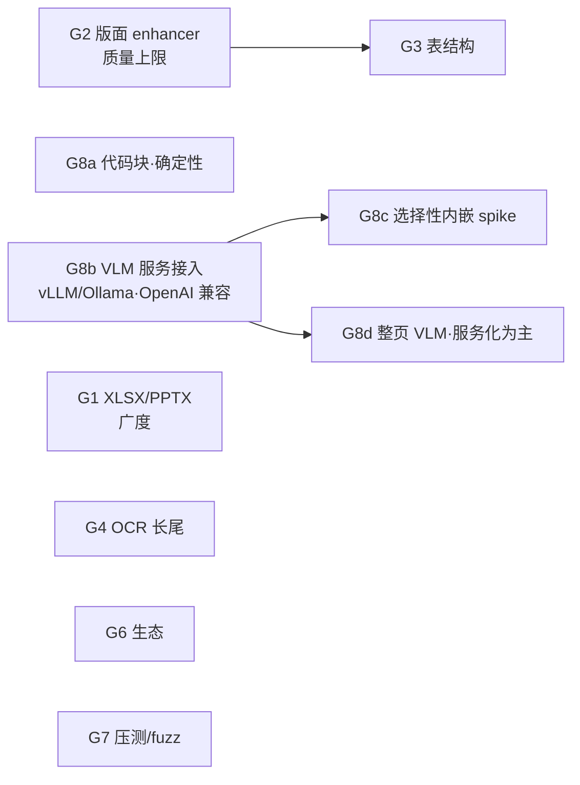

# 迭代计划 · Phase 4(G1–G8):补齐 Docling 明显占优的轴

> 依据:[refer/docling-objective-comparison.md](../refer/docling-objective-comparison.md) 的诚实清单——逐条映射成里程碑。承接 [next-iteration.md](next-iteration.md)(N1–N6 已收官)。
>
> **边界(2026-06-10 定位修订)**:纯 Rust/确定性核心独立/模型可插拔不动;"不光栅化"改述为"**主流程不渲染像素;难页 AI 增强可按需用纯 Rust 工具渲染该页(默认关闭)**"——以"速度快、质量好"的产品定位为准。补差距的手段分三层——**确定性可自研的直接做**(格式广度/区域 OCR/Form 流/代码块检测),**小模型沿 N3 已验证的 P4 模式内嵌**(tract + 外部 ONNX,先 spike 门控),**重模型/VLM 经 G8 语义增强面接入**(HTTP 外接先行,纯 Rust 运行时内嵌后探)。显式不追仅剩:GPU、为格式数铺长尾货。

## 0. 差距 → 里程碑映射

| Docling 优势(对比文档 §1) | 应对 | 里程碑 |
|---|---|---|
| 格式广度 15+ vs 3 | 确定性自研平齐:XLSX/PPTX/MD/CSV(G1a)+ 邮件/字幕/图片/AsciiDoc/LaTeX/XML 族(G1b) | **G1** |
| 难版面质量上限(神经版面) | ONNX 版面模型内嵌,难页路由(P4 模式) | **G2** |
| 表格结构精度(TableFormer) | ONNX 表结构模型内嵌(SLANet 系) | **G3** |
| OCR 广度(区域级/方向/多语种) | 区域级 OCR + cls + 多语种字典 + Form 流 | **G4** |
| RTL | BiDi 阅读顺序(评估需求后做) | **G5** |
| 生态(LangChain/LlamaIndex/社区) | Python 薄客户端 + 两个 loader + crates.io | **G6** |
| 鲁棒成熟度(海量语料锤炼) | 大语料压测 + fuzzing | **G7** |
| 内容增强(公式 LaTeX/代码/图片/图表/整页 VLM) | 三层:确定性 → HTTP 外接 → 纯 Rust VLM spike | **G8** |

## 1. 里程碑

### G1 · 格式广度:与 Docling 平齐(含长尾)— *模块 5* · 确定性自研
广度是 Docling 被首选的第一理由。**目标改为平齐**(用户决策 2026-06-10,撤销"不铺长尾"非目标):格式数 3 → 12+。全部走 `DocumentParser` trait + `synth` 合成坐标,每格式一个薄后端,注册表一行。

**G1a 主流办公(先做)**:

- [x] **G1a 全部完成 ✅**(2026-06-10,[devlog](../devlogs/2026-06-10-g1a-format-breadth.md)):docparse-xlsx(calamine)/ docparse-pptx(zip+quick-xml,每 slide 一页)/ docparse-md(pulldown-cmark)/ docparse-csv(零依赖手写)——格式数 3→7,97 单测,零回归。

**G1b 长尾(对齐 Docling 后端清单)**:

- [ ] **邮件 EML**:正文(text/html 部分复用 HTML 后端)+ 头部(From/Subject→标题结构)+ 附件列举;**依赖征询:`mail-parser`**(纯 Rust)。
- [ ] **字幕 SRT/WebVTT**:时间戳→段落 metadata,文本→正文;格式简单,**std 手写零依赖**。
- [ ] **图片即文档(PNG/JPEG/TIFF 单页)**:解码为单页全幅 ImageChunk → **直接复用 N3 OCR 路由**(我方独有优势:整条 OCR 管线已就绪);**依赖征询:`zune-png`**(JPEG 已有)。
- [ ] **AsciiDoc / LaTeX 源码**:常用子集手写解析(标题/段落/列表/表格);完整方言显式不保证,文档化边界。
- [ ] **XML 族(JATS 学术/METS-ALTO 档案)**:按真实需求逐个立项(quick-xml 复用);METS-ALTO 自带坐标,可出**真实 bbox**(非合成)。
- **验收**:每格式经同一 IR 出 chunks(带合成或真实 bbox);`supports()` 按扩展名注册;每格式至少一个样例端到端 + 单测;现有格式零回归。格式数 3→12+。

### G2 · 版面 enhancer:ONNX 版面模型内嵌 — *模块 8 / P4 模式* · 🎯 质量上限的正解
聚合记分牌剩余 gap(CJK 信息图 0.12–0.22、复杂首页)全在这——确定性已证不可强攻,Docling 靠 DocLayNet 系模型赢的就是这层。

- [x] **Spike 门控 ✅**(2026-06-10,[devlog](../devlogs/2026-06-10-g2-layout-spike.md)):DocLayout-YOLO(75MB,DocStructBench 含中文)在 `tract` 直接跑通,输出已解码框无需 NMS;CJK 难页正确识别双栏/标题/页眉脚;2.37s/页(仅难页触发)。table/formula 区域同模型可得(G3/G8c 共用)。
- [ ] **光栅来源**:born-digital 页需真实渲染(草图已否决)——选型分析见 [refer/rasterization-options-analysis.md](../refer/rasterization-options-analysis.md)✅ **已决**(2026-06-10):`docparse-raster` crate 包 hayro(纯 Rust,99ms/页),enhancer 难页按需渲染、默认关闭;外部工具兜底链暂不做。
- [ ] **触发**:N5c 画像已就绪——`scanned`/`mixed`/版面复杂信号页才路由(对版面模型,"难页"判据可用确定性输出的异常分:块重叠率/读序回跳),clean 页不碰模型。
- [ ] **归一**:模型出 region(标题/正文/图/表/页眉脚)+ bbox → 重排该页读序、修正标题/表区域;经 `Enhancer` 边界,source 标 `layout:<model>`,确定性结果仍独立成立。
- **验收 → 两轮更正后的真实状态(2026-06-10,[devlog](../devlogs/2026-06-10-g2-layout-enhancer.md) + [重大更正](../devlogs/2026-06-10-g2-correction.md))**:初版"负结果"系两个自家 bug(透明背景致黑渲染、分组替换静默失败)所致,修正后 enhancement 真实点火:**设计感版面大赢**(amt +0.180、normal_4pages +0.128),**clean 学术双栏倒退**(2203 −0.289)——版面模型与确定性几何各有禁区。`--layout` 保持手动 opt-in(记分牌默认不开,零回归);**剩余项=自动路由判据**(读序歧义分/区域分布,行填充率已试败),做成后按页自动取两者之优。

### G3 · 表结构 enhancer:ONNX 表结构模型内嵌 — *模块 8 / P4 模式*
TEDS 0.098/0.187 的主因是多级表头/合并单元格(神经域)。SLANet 系(PP-StructureV2,~9MB)输出结构 token + cell bbox,正是缺的拓扑。

- [ ] **Spike 门控**:SLANet ONNX 在 `tract` 的算子覆盖;输入是表区域图——born-digital 的表没有位图,born-digital 表区域经 `docparse-raster`(hayro)按需渲染——光栅决策已解(2026-06-10)。
- [ ] **G3b(确定性兜底)**:合并单元格/多级表头的几何推断(跨列 span 由对齐+横线覆盖推断)——P1c 教训在前,只做高置信形态,不强攻。
- **验收**:TEDS vs Docling 0.187 → ≥0.4(含表 6 份);检出零回归。⚠️ 此里程碑**风险最高**,spike 不过即降级为 G3b + N3b 外接,不硬上。

### G4 · OCR 长尾 — *模块 8 续*
- [x] **区域级 OCR ✅**(2026-06-10):`MixedTextAndScan` flag 路由混合页,OCR 结果与数字文本空间去重(数字层赢);合成混合页端到端验收。
- [ ] **方向分类 cls**:换源获取(ModelScope/PaddleOCR 官方转换),接入旋转校正;拿不到则文档化跳过。
- [~] **多语种**:模型加载已泛化(文件名自动发现+双前缀消毒,[v5 调研](../refer/paddleocr-v5-evaluation.md)),任意 PP-OCR 语言包目录 `--ocr-models` 即用(v5 server 实测通过);余:v5 mobile 自转、`--ocr-lang` 快捷方式。
- [x] **Form XObject 流解释 ✅**(2026-06-10,[devlog](../devlogs/2026-06-10-g4-form-streams-region-ocr.md)):`exec_content` 递归执行(深度上限 4),form 自带资源各自解析;`right_to_left_02` 0→0.972、表格检出大增 TEDS +30%/+43%;form 文本标 source 防标题误判。
- **验收**:混合页(文本+图章/扫描片段)端到端;Form 内文本/扫描图可达;现有样例零回归。

### G5 · RTL 阅读顺序 — *模块 3* · 按需
3 份 RTL 测试 0 分在案。BiDi 重排(**征询 `unicode-bidi`**)+ XY-cut 镜像。**先评估真实需求再做**——若目标语料无 RTL,显式记弃权而非默认排期。

### G6 · 生态接入 — *模块 10 外延* · 低代码高杠杆
- [ ] **Python 薄客户端**(`pip install docparse-client`):子进程包 CLI / HTTP 包 REST,零重依赖;
- [ ] **LangChain DocumentLoader + LlamaIndex Reader**:各 ~百行,产出带 bbox metadata 的 Document;
- [ ] **crates.io 发布**:workspace crate 整理(README.en 已就绪);MCP server 进 MCP registry。
- **验收**:LangChain 五行代码加载 PDF 带引用 metadata;PyPI/crates.io 可安装。

### G7 · 鲁棒长尾:语料压测 + fuzzing — *横切*
"海量语料锤炼"没有捷径,但可以系统性逼近:

- [ ] **大语料无 panic 压测**:arXiv 批量(千份级)跑 `-f chunks --quality`,统计 panic/超时/0 文本率与质量分分布,异常样本归档成回归集;
- [ ] **cargo-fuzz**:对 PDF 解释器/CMap/zip 预检三个入口做覆盖引导 fuzzing(**征询 dev 依赖 cargo-fuzz**);
- [ ] 撞到的崩溃/挂起各修各的,沉淀进 `limits` 守卫。
- **验收**:千份语料 0 panic 0 挂起;fuzz 各入口 24h 无 crash。

### G8 · 语义增强面:公式 / 代码 / 图片 / 图表 / 整页 VLM — *模块 8 扩展*
五项全要(用户决策 2026-06-10,推翻初版"不做"),但按"确定性 → 外接 → 内嵌"三层走,不一步跳到重模型:

- [x] **G8a 代码块检测 ✅**(2026-06-10,[devlog](../devlogs/2026-06-10-g8a-code-blocks.md)):等宽字体名(G2 铺路的 PS 真名)→ 行成组(豁免散文门)→ `Block.code` + 几何缩进重建 → Markdown fenced + chunk kind `code`。code_and_formula 端到端正确,记分牌零回归。
- [~] **G8b VLM enhancer:OpenAI 兼容服务接入** · 🚧 首增量完成(2026-06-10,[devlog](../devlogs/2026-06-10-g8b-vlm-client.md)):`docparse-vlm` crate(协议 mock 单测锁定)+ **图片描述任务**端到端(渲染裁剪→降采样→注入带 source 的位置文本);服务降级不破解析。余项:真实服务实测回填、图表→表格、公式、整页转写、页型判官、MCP/REST 透传。原设计如下:
  - **协议**:`/v1/chat/completions` + 图像输入(base64 data URL)——一个协议通吃 vLLM(Qwen2.5-VL/MiniCPM-V 等)、Ollama(qwen2.5-vl/llava 等)、LM Studio 与 OpenAI 系云端;docling-serve 作可选第二后端类型。
  - **配置**:`--vlm-url --vlm-model [--vlm-api-key]`(env 等价物),MCP/REST 透传开关;按任务的 prompt 模板内置(公式→LaTeX / 图片分类+描述 / 图表→表格 / 整页转写),结果归一回 IR 带 `source: "vlm:<model>"` + 低 confidence。
  - **图像来源(身份不破的部分)**:born-digital 的图片**多数本来就是嵌入光栅**——把现有 ImageXObject 解码门改为"VLM 任务开启时按需解码区域图",照片/图表/示意图直接喂 VLM,无需渲染;扫描页用已有位图裁剪。矢量内容(公式/矢量图)仍卡在 G8c 的合成栅格决策点。
  - **成本边界**:任务级 opt-in(默认全关)、按元素触发、并发与超时上限;数字纯文本页零外呼。
  - **依赖征询:HTTP 客户端(`ureq` 倾向,同步轻量)+ base64**。
  - **验收**:Ollama 本地(如 qwen2.5-vl)与 vLLM 各跑通一例图片描述+图表→表格;断网/服务缺失优雅降级(确定性结果不受影响)。
- [ ] **G8c 选择性 ONNX 内嵌(spike 门控,P4 模式)**:
  - 公式→LaTeX:PP-FormulaNet 系 ONNX × tract spike;
  - 图片分类:小 CNN 分类器(图表/照片/示意图)× tract spike;
  - ⚠️ **身份约束决策点**:这些模型吃**区域图**。扫描页区域可从位图裁剪(不破身份);**born-digital 的公式/图是矢量,喂模型必须合成栅格**——是否为"enhancer-only 合成栅格"开例外(主流程仍不渲染),**需用户拍板**;不开例外则 born-digital 区域走 G8b HTTP。
  - [ ] **G8d 整页 VLM**:**主路径 = G8b 服务化**(vLLM/Ollama 跑 SmolDocling/Qwen2.5-VL 级模型,整页转写难例扫描页)——服务侧天然有 GPU/量化/批处理,优于本地内嵌;`candle` 内嵌 spike 降为**远期可选**(离线单机场景才值得)。
- **验收**:G8a 代码块在 `code_and_formula` 样例正确标注;G8b 对 Ollama 与 vLLM 各端到端一例(图片描述/图表→表格),数字纯文本页零外呼;G8c 以 spike 结论定去留;G8d 以服务化为主、内嵌 spike 远期。

## 2. 次序与依赖

| 里程碑 | 价值 | 风险/前置 | 新依赖(均先征询) |
|---|---|---|---|
| **G2 版面**(建议先做) | 聚合记分牌最大剩余 gap | spike 门控;难页判据设计 | 无(模型外部文件) |
| G1 广度(a 主流+b 长尾) | Docling 首选理由,确定性低风险;图片格式可直连 OCR | AsciiDoc/LaTeX 只做子集 | calamine / quick-xml / pulldown-cmark / mail-parser / zune-png |
| G4 OCR 长尾 | 混合页+Form 流补完 N3 | cls 模型获取 | 无 |
| G3 表结构 | TEDS 主差距 | **最高**:tract 算子 + 可能触身份约束 | 无 |
| G6 生态 | 可见度/采用率 | 无技术风险 | PyPI 侧 |
| G7 鲁棒 | "成熟度"差距唯一解法 | 跑批时间 | cargo-fuzz(dev) |
| G5 RTL | 按需 | 需求未证实 | unicode-bidi |
| G8 语义增强面 | 五项能力(用户点名) | G8b(OpenAI 兼容,vLLM/Ollama)低险先行;G8c 有身份决策点;G8d 主走服务化 | ureq+base64(G8b)/candle(G8d 远期可选) |

**建议次序**:G2 spike(半天定生死)→ G2 落地 → **G8a(确定性代码块,小)+ G8b(HTTP 外接,解锁五项)** → G1 → G4 → G3 spike → G8c spike → G6/G7 穿插 → G8d spike(远期)。每里程碑照 SDD:plan 已有(本文),完成回填 devlog + testresults,记分牌即验收门。

## 3. 显式不做(守住定位)

- 自研训练任何模型:增强面全部用现成模型(ONNX 内嵌或 HTTP 外接);
- GPU 加速:与零依赖单二进制身份冲突,不做(重推理负载属 G8b 后端的职责);
(原"不追格式平齐"已撤销——见 G1b,用户决策 2026-06-10。)
