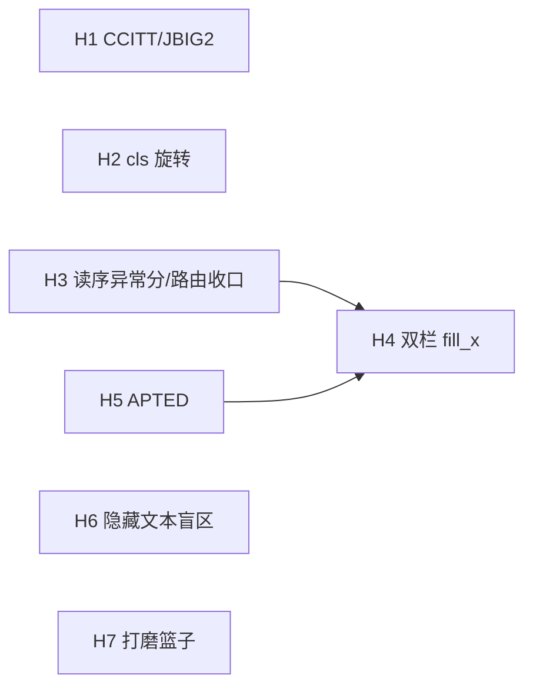

# 迭代计划 · Phase 5(H1–H7):健壮性纵深与质量债清偿

> 承接 [closing-docling-gaps.md](closing-docling-gaps.md)(Phase 4,G1–G9 可自主项已全部收官,2026-06-11)。
> 立项依据:**2026-06-11 待办重审**——滚动待办偏向新功能,把藏在代码 TODO 与旧计划未勾框里的健壮性债务漏掉了;本计划把它们捞回来,按"真实世界覆盖面 > 评测尺子 > 打磨"排序。
>
> **边界(延续)**:纯 Rust、确定性核心独立、模型可插拔(进程内 tract 或可选 OpenAI 兼容服务外接);主流程不渲染像素,难页增强按需渲染。本阶段**不追**:GPU、发布(用户暂缓)、为格式数铺货。

## 0. 来源 → 里程碑映射

| 债务来源 | 内容 | 里程碑 |
|---|---|---|
| images.rs TODO | CCITT/JBIG2/JPX 1-bit 扫描只记位置不解像素 → `--ocr`/转写对一大类真实扫描件失效 | **H1** |
| G4 未勾框 | 方向分类 cls 缺失 → 旋转扫描件 OCR 乱码(测试材料现成:data_scanned 三份 rotated) | **H2** |
| G2 未勾框 + M7 留空 | `--layout` 自动路由无判据(三个几何判据已败);quality 模块的读序异常分一直留空 | **H3** |
| layout.rs M3 TODO | 双栏左列不重排(fill_x 用页宽右缘,左栏永远够不着) | **H4** |
| next-iteration 未勾 | TEDS 仍是近似 proxy;span 入 IR 后,proxy 无法正确奖励 span 结构 | **H5** |
| N5a TODO | 隐藏文本检测两个盲区:同色文本、图像遮挡(防注入故事的已知缺口) | **H6** |
| 各处小 TODO | v5-mobile 自转、HTML charset、CMYK JPEG、MediaBox 继承、转写区域去重 | **H7** |

## 1. 里程碑

### H1 · CCITT/JBIG2 1-bit 扫描解码 — *模块 2/8* · 🎯 真实覆盖面最大缺口 ✅ 2026-06-11
真实世界扫描 PDF 大量使用 CCITT G4(传真压缩);现状 `ImageKind::None` 位置占位,整条 OCR/转写管线对其失效。

- [x] **依赖征询(已答,2026-06-11 review)**:`hayro-ccitt`/`hayro-jbig2`/`hayro-jpeg2000` 均已是传递依赖(经 docparse-raster→hayro),提为直接依赖零新增供应链面;首选 `hayro-ccitt`(为 PDF CCITTFaxDecode 语义而写,K/BlackIs1 对口),原"JBIG2 纯 Rust 生态弱"判断过时;
- [x] images.rs:CCITTFaxDecode 滤镜 → 1-bit 位图 → 扩展为 Gray8(`ImageKind` 复用,无 IR 变更);K/BlackIs1/Columns/EncodedByteAlign 照 PDF 32000-1 §7.4.6,DecodeParms/JBIG2Globals 在 build 期解析(decode 跑在 worker 线程无 doc 访问);附带:ImageMask 默认 1bpc、/Decode [1 0] 翻转、packed 1-bit Flate 展开(三者单测覆盖);
- [x] JBIG2 顺手接入(`hayro-jbig2`,含 Globals):pdf.js 语料真实样例(拉丁古籍扫描)`--ocr` 出文字,release 8.9s/页(OCR 主导);JPX 仍占位(无样例,README 边界已更新);
- [x] e2e:PIL 造单 strip G4/G3 TIFF→手工包 CCITTFaxDecode PDF(tiff2pdf 二进制损坏,绕过),G4 0.55s、G3 均逐字正确;
- **验收 ✅**:CCITT G4/G3 经 `--ocr` 出逐字正确文本;零回归——三件套 ✓、双记分牌 ✓(ODL NID 0.792/MHS 0.685/TEDS 0.419;Docling NID 0.822/MHS 0.643/TEDS 0.474,均与基线一致)、clippy 0 warning、全单测绿;devlog 见 [2026-06-11-h1-ccitt-jbig2.md](../devlogs/2026-06-11-h1-ccitt-jbig2.md)。

### H2 · 方向分类 cls(旋转校正)— *模块 8 / G4 余项* ✅ 2026-06-11
排查发现问题一分为二(docling rotated 三件是 `/Rotate` 属性、图像本体是正的),实际落地两个机制:

- [x] **H2a · /Rotate 尊重(确定性,无模型)**:/Rotate 沿 Pages 树继承读取,**烘进解释器基 CTM**(渲染器设备变换同法)——所有坐标原生出在视觉空间,90/270 页尺寸互换;born-digital 横排页(真实世界 /Rotate 主场)直接受益;顺带清了 H7 的 MediaBox 继承 TODO(`inherited_attr` 走查器两者共用);ImageChunk 新增 `turns` 字段(serde 默认 0)记录放置旋转;
- [x] **H2b · cls 方向校正(像素级旋转扫描)**:模型获取成功(HF `SWHL/RapidOCR` 的 `PP-OCRv1/ch_ppocr_mobile_v2.0_cls_infer.onnx`,~0.6MB,可选加载、缺失则跳过 180° 检测);90/270 用 det 框纵横比投票(竖条行)+ 转正重 det,180 用 cls 多数票(同时消解 90/270 歧义);
- [x] **方向归一化语义**(devlog 记决策):纯扫描页检测出旋转 → 输出归一化到内容正立坐标系(Docling 同口径,读序/引用指正立页;90/270 页尺寸互换),为此 `Enhancer::enhance_page` 改为返回 `Page`(可改页几何);混排页保持 viewer-faithful。已知边界:混排+旋转页的竖排 chunk 在 text 渲染层不可见(JSON 仍在),记 H3/H4 关联观察;
- **验收 ✅(修订口径)**:`ocr_test_rotated_{90,180,270}` 相似度 **1.000/1.000/1.000**(≥0.95 门);自造像素旋转四方向(pixrot_0/90/180/270,无 /Rotate)全部逐字正确;零回归——未旋转 ocr_test ✓、三件套 ✓、双记分牌与基线一致 ✓、H1 CCITT/JBIG2 样例 ✓、clippy 0、全单测 135 绿(+2 旋转辅助、+1 /Rotate 解释器);devlog [2026-06-11-h2-cls-rotation.md](../devlogs/2026-06-11-h2-cls-rotation.md)。

### H3 · 读序异常分 + `--layout` 自动路由最后一试 — *模块 3/7 / G2 收口* ✅ 2026-06-11
三个几何判据已实测失败(行填充率/XY-cut 歧义/左缘覆盖,均有 devlog)。最后一个在案候选:**确定性输出的读序异常分**(块重叠率/读序回跳次数)——它同时补上 quality 模块(M7)留空的 reading-order 异常项。

- [x] quality.rs:新增 `reading_order_anomaly`(读序相邻块 y 回跳率,纯几何、便宜,用输出同款 reading_order);
- [x] Python 探针在 amt/normal_4pages(赢)vs 2203/2305(输)验证可分性——**先探针后落码**(G2 死代码教训);
- [x] **不可分,且方向反**(amt 赢=0.000 与 2305 输=0.000 无法区分,2203 输反而最高 0.124)→ **关闭确定性路由路线**,`--layout` 永久文档级手动 opt-in、页型判官归外接服务(VLM/小分类器,按需);
- **验收 ✅**:二选一明确落地(关闭确定性路由);`reading_order_anomaly` 作为诊断信号进 `--profile`(非 auto 开关,字段 doc 写明)补 M7 留空项;记分牌默认路径零回归;136 单测绿(+1 不变量:clean 页恒 0 不误报)。devlog [2026-06-11-h3-reading-order-anomaly.md](../devlogs/2026-06-11-h3-reading-order-anomaly.md)。

### H4 · 双栏左列段落重排(fill_x 修复)— *模块 3 / M3 老债* ✅ 2026-06-11
`group_blocks` 的续行条件要求前行触达 `fill_x`(页宽口径),双栏左列永远不满足 → 左列逐行成块、不聚段。

- [x] 列感知 per-line fill_x(`column_fill_edges`):从严 gutter 检测(两侧各 ≥25% 行、跨越率 <12%、页中部),每行用本列右缘判续行;`group_blocks` 收 `&[f32]`、`Acc` 记块起始列右缘;
- [x] ⚠️ 关键安全性质:**无 gutter 时逐行退化为旧单一 fill_x,单栏字节级零回归**(单测钉死);三件套+双记分牌+全量已跑;
- **验收 ✅**:2203 左列正文聚成 814/790/720 字符长段(此前逐行碎块);NID 双记分牌**不降**(0.792/0.822),MHS 微升(0.685→0.687、0.643→0.645);138 单测绿(+2:双栏重排 + 单栏零回归不变量),clippy 0。devlog [2026-06-11-h4-two-column-reflow.md](../devlogs/2026-06-11-h4-two-column-reflow.md)。

### H5 · TEDS 换精确 APTED — *评测尺子 / N4 余项* ✅ 2026-06-11
当前 proxy(形状+行对齐 DP)已两次掩盖真实变化;span 入 IR 后只有树编辑距离能正确计分 span 结构。

- [x] scripts/eval:树构造(table→tr→td:rs×cs)+ **Zhang-Shasha 精确树编辑距离**(PubTabNet 代价模型,纯标准库 ~80 行,评测侧零依赖——比 `apted` 包更轻且无新依赖);三个 extractor(我方 `-f json`、docling GT、ODL)透传 span 锚点 `tables_cells`;
- [x] `TEDS_X` 与 proxy `TEDS` 并行出列,composite 仍走 proxy(历史可比);差异最大的 4 例逐个核对、双向都有信号差(见 testresults);
- **验收 ✅**:`TEDS_X` 上线(ODL 含表 7 份 0.419→0.477、Docling 6 份 0.474→0.526),proxy 保留对照、历史聚合数字未变;span 输出(`--table-model`)在精确尺下结构对齐获得奖励(修好"尺子不奖励 span");selftest +4 断言全过;数据见 [testresults/2026-06-11-h5-exact-teds.md](../testresults/2026-06-11-h5-exact-teds.md)。⚠️ 副产发现:`--table-model` 在 2305-pg9 上把每物理行拆成两行(行切分 bug,G3-R 模型侧噪声),记按需池。

### H6 · 隐藏文本检测盲区 — *模块 9 / N5a 余项*
- [ ] 同色文本:fill 色与背景色同(需追踪 `rg/g/sc` 填色态 + 页面底色启发);
- [ ] 图像遮挡:文本 bbox 被其后绘制的不透明图像完全覆盖;
- [ ] 两者都标 `hidden=true` 进现有审计通道;合成样例单测;
- **验收**:合成注入样例被拦截并可审计;真实文档零误杀(三件套+语料扫 hidden 计数无异常增长)。

### H7 · 打磨篮子(小 TODO 清偿)— *横切*
逐项小步,各自带回归:
- [x] MediaBox 继承(Pages 树向上回溯,替换 US Letter 兜底)——H2a 顺带完成(2026-06-11,`inherited_attr` 与 /Rotate 共用);
- [ ] HTML charset(textio 探测接入 html 后端,meta charset 优先);
- [ ] CMYK JPEG(`--image-dir`/`--image-embed` 直通件转 RGB 或文档化);
- [ ] 转写区域重叠去重(相邻重复行);
- [ ] v5-mobile 自转(paddle2onnx 一次性工序,产出放 models/ 说明)。

**2026-06-11 H1/H2 自审遗留**(review 确认、本轮未修,候 H7/按需):
- [ ] 归一化页 × 下游栅格增强器组合(`--ocr --layout/--transcribe/--vlm-*` 同开于旋转纯扫描页):hayro 渲染只认 /Rotate 不认 OCR 检出的 dturns,区域映射会错帧——加"归一化页跳过栅格增强"守卫或让栅格路径读归一化标记;
- [ ] `--image-dir`/`--image-embed` 导出忽略 `ImageChunk.turns`:/Rotate 页导出的图相对文档侧躺(JSON 有 turns 字段可查,Markdown 引用无提示);
- [ ] transcribe/layout/formula 路径无方向校正(orient 只在 PpOcrEnhancer):像素旋转扫描走 `--transcribe-model` 会被退化守卫拦或出垃圾;
- [ ] 走查器统一:`inherited_attr`(lib.rs,深 32)与 font.rs `resolve_resources`(深 16)重复;`stream_bytes` 与 JBIG2Globals 解析重复;三处四分之一转实现(解释器矩阵 / `rotate_pdf_bbox` / `rotate_box`)候 `Matrix::quarter_rotation` 收编;
- [ ] 1-bit Indexed 调色板正确映射(现位置占位,TODO 在 images.rs);decode_bilevel 大页逐像素 push 可换 LUT。

## 2. 次序与依赖

> 2026-06-11 review 修正:H1→H2 无技术依赖(cls 接在 OCR 路由图像之后,与解码滤镜无关;rotated 测试件非 CCITT 编码),两者可并行。

**建议次序**:H1(覆盖面,依赖已定)→ H2(材料现成,可与 H1 并行)→ H5(先修尺子再动 H4 的核心分组——老教训)→ H3 → H4 → H6 → H7 穿插。每里程碑照 SDD:完成回填 devlog,记分牌即回归门。

## 3. 按需池(不排期,候触发)

- 行内公式(无区域信号,需行内检测器)/ G3b 确定性 span 推断(模型路径已通,低优);
- `--table-model` 行切分:2305-pg9 上把每物理行拆成两行(H5 副产发现,G3-R 模型侧噪声);
- JATS / METS-ALTO(真实 bbox)/ TIFF;RTL 与韩文等多语种(需多语种模型,按需外接 OpenAI 兼容服务或换模型);
- Markdown/HTML 输出利用 span;人工真值评测集(用户决策);
- 发布族:PyPI / crates.io / MCP registry(用户暂缓);arXiv 千份压测、fuzz 24h(资源/排期)。
