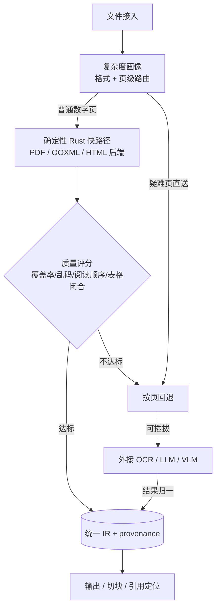
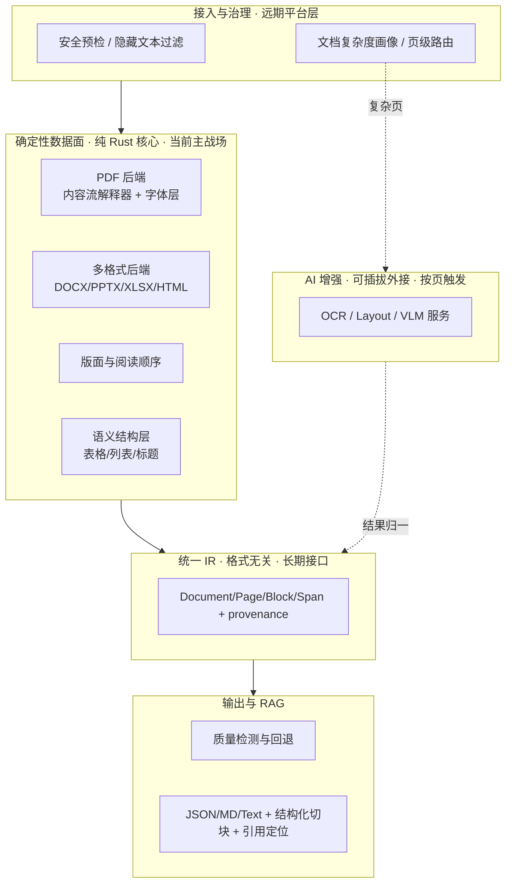
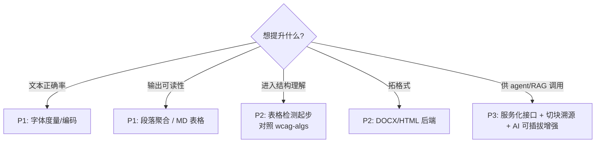

# 总体开发迭代计划 · Development Roadmap

> 本文是 docparse-rs 的**战略主计划**：长远愿景、大功能模块、分阶段路线。只写"做什么、为什么"，不写实现细节。
>
> - 近期可执行的解析器特性清单见 [iteration-guide.md §5](iteration-guide.md)（战术层，本文 P1 阶段的细化）。
> - 已完成工作的验证与设计回顾见 [phase-1-summary.md](phase-1-summary.md)。
> - 大格局背景（开源工具全景、平台架构、Rust 取舍）见 [refer/document-parsing-open-source-tools-research-2026.md](refer/document-parsing-open-source-tools-research-2026.md)。
> - 协作约定见 [../CLAUDE.md](../CLAUDE.md) 与 [../AI_AGENT_DEV_SPEC.md](../AI_AGENT_DEV_SPEC.md)。
> - 当前状态/记分牌/待办/经验见 [status.md](status.md)；系统架构见 [architecture.md](architecture.md)；功能/能力清单见 [capabilities.md](capabilities.md)；**接入 Agent/RAG 系统**见 [agent-integration.md](agent-integration.md)。
>
> **本文是战略/愿景层（做什么、为什么），写于早期且按需更新；具体进度以 [status.md](status.md) 为准——两者冲突时信 status.md。**

---

## 1. 长远愿景

> 用 Rust 实现一个**速度快、质量好**的完整自洽文档解析系统：从文件接入到带位置的结构化内容（文本/版面/表格/阅读顺序 → 统一 IR → JSON/Markdown/Text/RAG 切块）**全链路在 Rust 内完成**。**对外**可供任意 Agent / RAG 系统直接调用；**对内**可灵活接入 OCR、大模型等外部服务增强难例。它是一个独立的系统/产品，而非某个更大平台的子组件。

四条不动摇的身份约束：

| 约束 | 含义 |
|---|---|
| **完整且自洽** | 核心解析全链路纯 Rust 自研；确定性路径**不依赖任何外部服务即可独立产出结果** |
| **面向 Agent** | 稳定版本化 IR + 坐标/溯源 + CLI/库/服务化接口；任意 agent 可消费，结果**可复现、可引用** |
| **AI 可插拔** | OCR / 大模型 / VLM 是**可选增强**，经统一插件边界灵活接入；主流程不被其绑定 |
| **纯 Rust · 快路径优先** | 无 JVM / C++，单二进制易分发（边缘/内网/桌面/WASM）。**主流程不渲染像素**（该快的地方照样快）；只有被判定为难页、要请 AI 帮忙时，才用纯 Rust 工具按需画那一页（opt-in，默认关闭）。一切以"**速度快、质量好**"的产品定位为准，不为教条牺牲质量 |

---

## 2. 战略定位（第一性原理）

调研报告是**参考与坐标系**（开源工具全景、能力维度、Rust 取舍），不是要照搬的架构。报告推荐"Rust 控制面 + Python/Java AI worker 作核心处理"的多语言平台；本项目的取舍不同：

> **docparse-rs 自身就是完整系统**——核心解析能力全部纯 Rust 自研、独立成立；OCR / 大模型是**可选外接增强**，用来补难例（扫描件、复杂表格、语义富化），而非系统赖以运转的核心。它从**内容流解释器 + 字体层**（ODL 委托给 veraPDF 的那一层）自底向上做起，正因为这是不可外包的根。

为什么这样定位：

- **agent 要的是确定、可复现、可引用**——确定性 Rust 路径天然满足；把它做完整就直接服务任意 agent。若核心依赖外部大模型，确定性与可控成本就丢了。
- **AI 作增强、不作底座**：多数数字文档无需任何模型即可高质量解析；模型只在质量检测判定为难例时**按页触发**，主流程不被 GPU / Python 依赖绑定。
- **语义层是最大奖品，增量自研**：表格 / 列表 / 标题分级是 veraPDF-wcag-algs 的等价物（数人年工程），从"先做有框表格"起步，**参考算法、独立实现、标注出处**，绝不复刻全量、绝不拷贝 GPL 代码。

增长次序：

先把确定性核心做到能独立交付价值 → 打磨面向 agent 的接入面 → 再叠 AI 可插拔增强。**不在核心成立前先建编排机器。**

### 对标 Docling：赢 / 持平 / 不打

战略定位落到一个具名对手上才可证伪。Docling 是当前多格式通用解析器的事实首选（统一 `DoclingDocument`、PDF/Office/HTML 全覆盖、MIT、RAG 生态成熟，ODL 自测 benchmark 综合 **0.882**）。它的结构性弱点：**重依赖**（Python + 模型下载 + 冷启动）、**功能即代价**（OCR/表格/公式无法对所有页无条件开）、**模型许可复杂**（代码 MIT ≠ 模型 MIT）、**黑盒难溯源**。据此把"更好"分三档，**不笼统**：

| 战场 | 定位 | 为什么 |
|---|---|---|
| **数字原生文档**（有文本层/结构的 PDF/DOCX/HTML） | **要赢** | 更快、确定、可溯源、零依赖单二进制——Rust 快路径跑常见页天然优于神经版面分析 |
| **结构理解**（表格/列表/标题层级，born-digital） | **要持平** | 有规则线/有标签时可确定性求解，对照 wcag-algs 独立实现 |
| **多格式广度** | **要持平** | DOCX/HTML 有显式结构、ROI 最高先行；广度是 Docling 的首选理由，须够得着 |
| **扫描 OCR / 神经表格 / 公式 / 手写** | **扫描 OCR 已可打**（N3：进程内纯 Rust ONNX，按页路由）；神经表格/公式/手写仍外接不打 | 中文扫描经 PP-OCRv4×tract 进程内解决（部署最轻）；其余需模型进步，经可插拔边界外接 |

> 一句话：**在数字原生文档上用"零依赖 + 确定 + 可溯源 + 单二进制"赢下部署/成本/可复现这三件 agent 真正在乎的事；结构与广度够到 Docling 的 born-digital 水平；模型重的长尾外接而非塞进主流程。** 这与 §1 四条身份约束同构——确定性核心赢、AI 增强不绑定。每条战场如何量化见 §6 记分牌。

---

## 3. 生产架构：路由 + 质量回退 + 统一 IR 脊梁

调研报告 §6 推荐的"生产方案"本质是一套**编排架构**——文件路由 + 质量回退 + 统一规范化输出 + 质量评分，用来协调多个**独立工具**（Docling 统管、ODL 跑数字 PDF、MinerU/PaddleOCR 跑扫描、Tika 兜底长尾）。docparse-rs **不是编排这些工具，而是把这套模式内化成一个 Rust 系统**：把每家的看家本领吸收进对应层——确定性能力自研、模型能力外接。

### 各家优点 → docparse-rs 落点

| 报告里的工具 | 真正的看家本领 | docparse-rs 落点 | 形态 |
|---|---|---|---|
| **OpenDataLoader** | 数字 PDF 快确定性结构抽取 + 元素坐标 + 隐藏文本过滤 | PDF 确定性后端（模块 2） | 自研·核心 |
| **Docling** | 统一文档模型 + 多格式 + RAG 生态 | 统一 IR（模块 1）+ 多格式后端（模块 5）+ 输出/RAG（模块 6） | 自研·核心 |
| **MarkItDown** | 轻量低依赖、markdown-first 的简单入口 | 原生轻量输出 + 简单格式快路径（模块 5/6） | 自研·核心 |
| **MinerU / PaddleOCR** | 扫描 / 中文 / 公式 / 复杂表格（靠模型） | 外部 AI 服务接入（模块 8） | 外接·可选 |
| **Tika** | 长尾 / 旧格式检测 + 元数据 | 格式检测（模块 9）+ 长尾回退适配 | 自研 + 外接 |

> 关键：docparse-rs **自己就是**那个"统一模型"，而非报告里"以 Docling 作统一模型"；确定性的能力**内化自研**，模型重的能力**可插拔外接**。

### 生产流水线（一份文档怎么走完）

便宜确定的先上，只有质量评分判定为难例才**按页**升级到外接模型——多数页不碰模型，成本可控（报告 §7）。所有路径的结果都归一到**同一份带 provenance 的 IR**，下游只面对一种 schema。

### 脊梁：统一规范化 IR + 质量评分

报告这条推荐的落脚词是"建立统一的规范化输出和质量评分"——它不是附属，而是整套架构成立的**脊梁**，也是"集合各家优点"在技术上的**真正核心**：

| 脊梁 | 缺了它就 | 对应模块 |
|---|---|---|
| **规范化 IR**（带 provenance） | 无法归一/融合多来源结果，无法对下游屏蔽差异 | 模块 1 |
| **质量评分** | 路由不知走哪条、回退不知何时升级、生产不知能否放行 | 模块 7 |

**工程次序**：IR + provenance + 质量评分这套**契约**便宜且高杠杆，应**早定**（所有解析路径都要路由在它上面）；路由 / 回退 / 插件那套**机器**晚建（P3）。**先定契约，再造机器。**

---

## 4. 能力分层与大功能模块

| # | 大模块 | 职责（做什么 / 为什么） | 当前状态 | 算法/架构参照 |
|---|---|---|---|---|
| 1 | **统一 IR** | 格式无关数据模型 + 版本化 schema + provenance（解析器/版本/置信度）。系统最重要的长期接口 | ✅ 版本化 `SCHEMA_VERSION` + provenance + 每 chunk confidence（M2） | 报告 §6 Document IR / `document-ir` |
| 2 | **PDF 确定性后端** | 内容流解释器 + 字体层 + 精确坐标，纯 Rust 复刻 ODL 快路径 | ✅ 内容流+字体层成熟（AFM/Encoding/CMap/字距，M1）；clean LTR 达 ODL/Docling 水平 | veraPDF-parser（`pd.font`/CMap） |
| 3 | **版面与阅读顺序** | XY-cut 多栏排序、页眉页脚/水印识别、段落聚合 | ✅ XY-cut+段落聚合+页眉页脚+去连字（M3）；CJK/最难双栏首页属确定性天花板（→模块 8）；opt-in 版面模型双后端 DocLayout-YOLO / **PP-DocLayoutV2**（25 类+原生读序，Phase 7，杂版面端到端表 ≈3×） | ODL XY-Cut++ |
| 4 | **语义结构层** | 表格识别、列表层级、标题分级——把 chunk 升维成结构。最大、最有价值、最难 | ✅ 表格四检测器（bordered/ruled/cluster/borderless，M4+N4）+ 标题分级；多级表头/合并单元格属神经域 | veraPDF-wcag-algs（`TableBorderConsumer`/`ClusterTableConsumer`） |
| 5 | **多格式后端** | 各 `impl DocumentParser` 汇入同一 IR | ✅ **12 种格式全接入**：PDF/DOCX/HTML/XLSX/PPTX/Markdown/CSV/SRT·VTT/LaTeX/EML/图像/AsciiDoc（含各格式内嵌图片→image chunk） | 报告 §10.6 `parser-ooxml`/`parser-web` |
| 6 | **输出与 RAG** | 序列化 + 结构化切块 + chunk↔页码/bbox 双向引用定位 | ✅ JSON/MD/Text + 结构化切块 + chunk↔bbox 双向引用（M6），引用率 100% | 报告 §10.6 `document-export`/`document-chunk` |
| 7 | **质量检测与回退** | 覆盖率/乱码率/阅读顺序异常评分，决定是否触发外接复核 | ✅ 评分（coverage/garbled）+ 按页路由（M7）；reading-order 异常分留空 | 报告 §8 / §10.8 |
| 8 | **外部 AI 服务接入** | OCR / 大模型 / VLM 作**可选增强**：版本化 capability（格式/元素/语言/设备/版本）+ 统一边界，按页触发补难例，主流程可无之独立运行 | ✅ 边界（M7）+ 真实 enhancer：ONNX 内嵌 PP-OCRv4 经 tract 纯 Rust 推理（N3/P4），按页路由、数字页零模型 | 报告 §10.5–§10.6 `parser-plugins` |
| 9 | **安全预检与画像** | 恶意对象/ZIP bomb 防护、隐藏文本过滤（防 prompt injection）、复杂度路由 | ✅ 隐藏文本过滤（N5a）+ 资源防护（N5b：zip-bomb 预检/页数早停）+ 复杂度画像（N5c：`PageProfile` 页级 kind/信号） | ODL 隐藏文本过滤 / 报告 §10.2–§10.3 |
| 10 | **Agent 接入面与运行时** | 面向 agent 的消费接口：CLI（已有）/库/服务化（REST/gRPC/MCP）+ 调度/优先级队列/阶段缓存/可观测 | ✅ CLI/库/MCP（stdio）/REST（axum）四接口，输出跨接口逐字节一致（N2）；调度/阶段缓存按需后议 | 报告 §10.6 `document-runtime`/`server` |

> 模块即未来的 crate 边界，但**按需拆分**——不为架构整齐提前建空 crate（反 MVP，见 AI_AGENT_DEV_SPEC §3）。

---

## 5. 分阶段路线图

> 阶段以"独立有用户价值"为拆分依据，非按工时。每阶段进入前补 plan、完成后补 devlog（SDD 流程见 AI_AGENT_DEV_SPEC §4）。

| 阶段 | 主题 | 目标（用户视角） | 牵头大模块 | 状态 |
|---|---|---|---|---|
| **P0** | 纯 Rust PDF 抽取骨架 | 数字 PDF 端到端读出带坐标文本，三种输出 | 1,2,3 | ✅ 已完成 |
| **P1** | 文本保真与版面可读 | 数字 PDF 文本接近无损；输出按段落/表格可读，而非逐行 | 2,3 | ✅ 已完成（M1–M3）|
| **P2** | 语义结构 + 多格式 | 输出是**结构**（表格/列表/标题层级）而非纯文本流；覆盖 DOCX/HTML | 4,5 | ✅ 基本完成（M4 有框表格 + M5 DOCX/HTML；表格四检测器 bordered→ruled→**cluster**→borderless，确定性检出达 ODL 量级；多级表头/无框结构属 N3 神经域）|
| **P3** | Agent 接入与 AI 增强 | 成为任意 agent 可直接调用的**完整系统**：稳定 IR 协议、引用定位、服务化接口（REST/MCP）；难例可插拔接入 OCR/LLM；质量回退、安全预检 | 1,6,7,8,9,10 | ✅ 完成（M2 IR 脊梁、M6 切块溯源、M7 质量路由、N1 评测、N2 服务化 REST+MCP、N5 安全预检、N3 真实 enhancer ONNX-OCR）|
| **P4** | 选择性模型内嵌 | 稳定小模型（页面分类/方向/轻量 OCR）以 ONNX 内嵌提速；大 VLM 仍外接 | 8 | ✅ 已随 N3 落地（RapidOCR PP-OCRv4 × `tract` 纯 Rust，模型外部文件；spike 与实现）|

**各阶段大致内容（高层，细节见对应 plan）：**

- **P1** — 标准 14 字体度量、简单字体 Encoding/Differences、字间距操作符（修文本保真）；段落聚合、Markdown 表格雏形（修可读性）。细化清单见 [iteration-guide.md §5](iteration-guide.md)。
- **P2** — 语义层从"先做有框表格检测"起步，再到列表层级、标题分级；并行验证多格式后端（DOCX 先行），坐标按 PDF 约定折算。
- **P3** — IR 版本化 + provenance；结构化切块与 chunk↔bbox 溯源；面向 agent 的服务化接口（REST/gRPC/MCP）；质量评分与失败页可插拔回退到外接 OCR/LLM；版本化插件协议；安全预检与复杂度画像/路由。
- **P4** — 把已稳定的小模型转 ONNX 用 `ort`/Candle 在 Rust worker 内推理，评估纯 Rust/Metal 部署；重型、迭代快的模型保持外部服务。

> **可执行里程碑（M1–M7）与依赖次序**：它把上面 P0–P4 按竞争杠杆细化为带验收的里程碑，并据 §3"先定契约"把 **IR 脊梁（版本化 + provenance）从 P3 提前到紧跟 P1**——便宜且解锁所有溯源/切块/路由。

---

## 6. 记分牌：怎么证明"更好"（可证伪）

不立指标的"更好"是口号。采用两类记分牌，每个阶段/里程碑完成都回填数字（落 status.md 记分牌 + devlog）。

**质量记分牌（对标 Docling，同尺）**——复用 ODL benchmark 三项指标，只在 **born-digital 子集**上同台，扫描件**显式弃权**并记录（那不是我们的战场，§2）：

- **NID** 阅读顺序 · **TEDS** 表格结构 · **MHS** 标题层级。目标分两档（2026-06-10 据 N1 实测改写，原"聚合三项不低于 Docling 0.882"对确定性路线不可达）：
  - **确定性路线（回归门，已达成须保持）**：clean born-digital LTR 子集 NID ≥0.92——后续任何改动不得击穿。
  - **聚合追平（N3 enhancer 的验收指标）**：剩余 gap（CJK 复杂版面、最难双栏论文首页）经实验证明属版面模型/外接增强域，聚合分追平 Docling 由 N3 负责，不再作确定性路线目标。
- **TEDS 边界须诚实标注**：G9d（2026-06-10）后**检出覆盖与结构双达实用线**——通道列+规则线分带行使 ruled/栅格表结构与 ODL 高度一致（pg9 0.804、redp5110 0.859、normal_4pages 韩文段落格 0.400）。TEDS 聚合 **0.419（ODL）/0.474（Docling）**（行对齐 DP + 全空网格对称过滤后的诚实口径；仍为近似 proxy，精确 APTED 待换）。余差在**图内嵌表**（2203/2305 论文里画在 figure 中的示例表）与合并单元格语义（rowspan/colspan 未建模）。
- benchmark **不可拼榜**（报告 §5.2）：只在自建可比子集比，不把不同项目的单分拼排行。

> **现状（2026-06-10 G9 收官，去 RTL born-digital LTR）**：vs ODL NID **0.792** / MHS **0.685** / TEDS **0.419**；vs Docling NID **0.822** / MHS **0.643** / TEDS **0.474**。**clean 子集达 docling/ODL 水平**（`multi_page` 0.984、`code`/`picture` 0.99、`redp5110` 0.985、`2203` 0.937、`2305` 0.962）。聚合余差：CJK 复杂版面（`skipped_*`）与图内嵌表 recall。⚠️ 历次关键纠偏**多数是评测/输出管线 bug 而非解析能力**：GT 提取器漏列表、chunk 页级 y-sort、TEDS 按索引配对（两次：发射序配对、行号级联错位）、跑页眉误判标题。**分数可疑先怀疑管线**。详见 [devlogs](devlogs/)。

**差异化记分牌（Docling 结构上无法同台）**——这才是"更好"的硬证据：

| 指标 | 测法 | 目标 |
|---|---|---|
| 二进制体积 / 运行时依赖 | `ls -la target/release/docparse` | 单文件 < 30MB（2026-06-10 由 20MB 上调：含 OCR+版面两套推理栈与按需渲染器；单文件零运行时依赖不变），运行时依赖 0 |
| 冷启动到首字节 | `time docparse small.pdf` | < 100ms（无模型加载） |
| 确定性 | 同文件跑 100 次 diff | 逐字节一致 |
| 吞吐（born-digital） | 页/秒 vs Docling 标准管线 | 显著领先（目标 ≥10×，待测） |
| 引用可定位率 | 每个输出 chunk 能否回指 bbox | 100% chunk 带 provenance |

> 记分牌即验收门：没有数字的阶段不算完成（SDD §4）。可执行里程碑与逐项验收。

---

## 7. 关键原则与边界

| 维度 | 立场 |
|---|---|
| 第一性原理 | 价值 = **完整确定性核心 + 稳定 agent 接口 + 可插拔 AI**：核心解析自研到独立成立，AI 只作增强外接，确定性与可控成本不丢 |
| 明确**不做** | 训练模型；把重型 VLM/OCR 硬编进主流程；一次性复刻 wcag-algs 全量。AI 经可插拔边界**外接**，核心解析**完整自研** |
| 许可边界 | 参考 veraPDF/ODL **算法**、独立实现并标注出处；本项目 Apache-2.0，**不引入 GPL 代码**（详见 [../CLAUDE.md §5](../CLAUDE.md)） |
| 反 MVP / 分阶段 | 主路径错误处理/测试/文档同 PR 铺到位；只有"上下游未就绪 / 单阶段独立有价值 / 需 spike"才真分阶段（AI_AGENT_DEV_SPEC §3） |
| 质量底线 | 坐标/IR 不变量恒守；字体/解码改动必跨样例回归；近似必标注；零 warning（[../CLAUDE.md §3–4](../CLAUDE.md)） |

---

## 8. 怎么挑下一步

**进度真源是 [status.md](status.md)**（逐 Phase 维护，远比本节实时）：P0–P4 + 后续 Phase 5–14（扫描解码/版面双后端/PP-OCRv6/CLI 进度与批量/速度质量三杠杆/结构树/OKF/机器可读契约/图片→RAG）均已下结论。过程记录见 [devlogs/](devlogs/)，能力清单见 [capabilities.md](capabilities.md)。本节不再复述进度，避免与 status.md 漂移。
